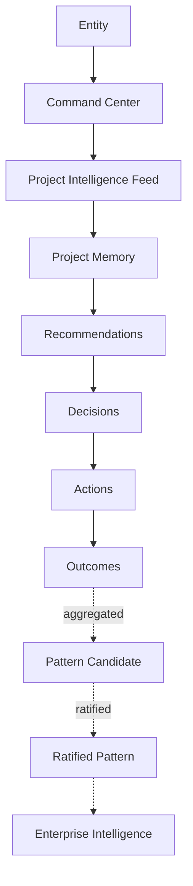
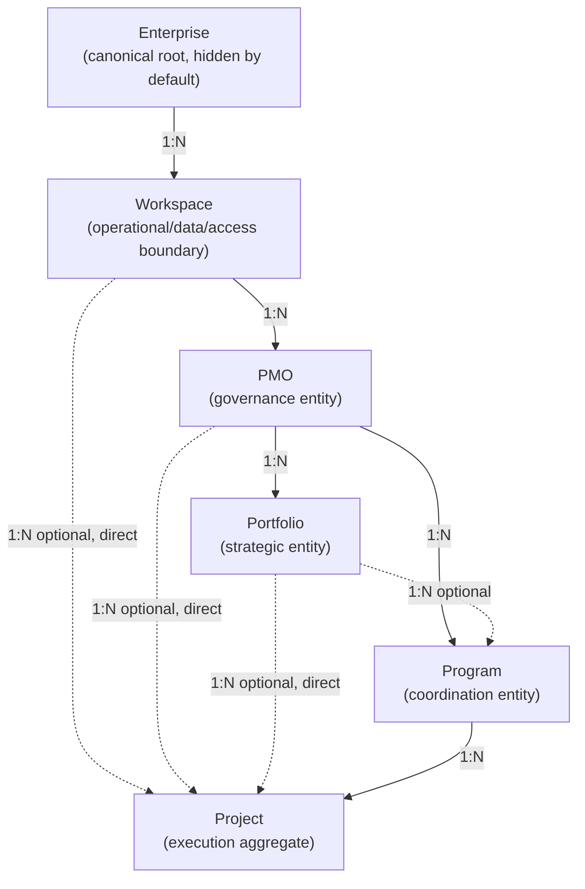
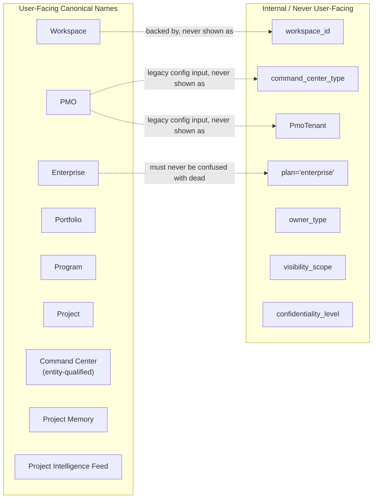

# PMFreak — PR2: Canonical Product Language & Conceptual Contracts

**Type:** Product language / information-architecture ratification. Documentation only. No product code, components, navigation, routes, styles, in-app copy, APIs, schemas, or migrations were modified to produce this document.

---

## 1. Executive Summary

PR1 (`docs/product-architecture/01-canonical-domain-model.md`) audited PMFreak's implementation against its stated PMI/enterprise vision and found a real, working `Workspace → PMO → Project` spine wrapped in inconsistent, overlapping naming — five to six meanings for "Command Center," six for "Portfolio," three for "Project" itself (Project/Context/Initiative). PR1.1 (`docs/product-architecture/01.1-domain-ratification.md`) and twelve ADRs (`docs/adr/ADR-PMF-001` through `012`) then ratified what each entity in the hierarchy *is* — its cardinalities, invariants, and per-entity contracts.

**Neither PR1 nor PR1.1 ratified what any of it is *called*.** They fixed the domain; they deliberately left "final visible navigation names," "final UI," and "documentation impact" as open items (PR1.1 §25, items 13 and 20). This PR closes that gap. It converts every ratified entity, projection, and knowledge-pipeline stage into a single canonical name, with a written contract for what that name means, what it never means, who sees it, and what words are forbidden as synonyms for it.

This is a **naming and information-architecture ratification**, not an implementation. It changes no code, no component, no route, no copy string, no schema, no migration. What changes is that "what do we call this, and only this, everywhere" now has one written answer per concept, with an ADR trail (`ADR-PMF-013` through `ADR-PMF-016`) recording the reasoning, exactly as PR1.1 did for domain semantics.

Result:

```text
CANONICAL PRODUCT LANGUAGE ESTABLISHED
```

— contingent on the consistency checks in §37 (Consistency Validation), all of which passed (see final status at the end of this document).

## 2. Purpose

To give PMFreak a single, governing **Product Language System**: one canonical name per concept, one meaning per name, a written contract every future screen, button, route, API field, agent message, and documentation page must conform to. Once this document is committed, no future PR may introduce a second name for an already-named concept, or reuse an already-named word for something new, without superseding this document through its own ADR — exactly as ADR-PMF-001 through -012 govern domain semantics.

This document does not reinterpret, reopen, or change any decision ratified in PR1.1 or ADR-PMF-001 through -012. Where this document states cardinalities, parent/child relationships, or entity behavior, it is restating the already-ratified contract for naming purposes, not re-deciding it. Authority for domain semantics remains `01-canonical-domain-model.md`, `01.1-domain-ratification.md`, and `docs/adr/`.

## 3. Product Language Principles

1. **One Concept → One Name.** Every distinct thing in the domain has exactly one canonical name. If two screens need to refer to the same entity, they use the same word.
2. **One Name → One Meaning.** A canonical name never refers to two different things. If "Portfolio" means the PMO-owned strategic entity, it never also means a personal saved-project list (that concept is named `Saved Projects`, not `Portfolio`).
3. **No Synonyms in Product.** User-facing surfaces do not rotate between "Workspace," "Space," "Environment," "Tenant," or "Organization" for the same concept. Pick one, use it everywhere.
4. **Domain First.** Naming follows the ratified domain model (PR1.1, ADR-PMF-001–012). Marketing or UI convenience never overrides a ratified entity boundary.
5. **UX Second.** Once the domain name is fixed, UX copy makes it clear and usable — but does not invent a friendlier alias that silently becomes a second name.
6. **Marketing Third.** Marketing may frame or contextualize a canonical name (e.g., "PMFreak's Command Center") but may never rename the underlying entity for a campaign, tier, or landing page.
7. **Technical Names Hidden.** Internal identifiers (`command_center_type`, `PmoTenant`, `workspace_id`, `owner_type`, `visibility_scope`, `confidentiality_level`, `plan='enterprise'`) are never shown to users, and never leak into UX copy, error messages, or agent responses.
8. **Progressive Disclosure.** Hiding a concept from a segment's UI (per ADR-PMF-012) never means renaming it, and never means inventing a simplified alias for the same entity. An Independent PM who never sees the word "PMO" still has a PMO row; the word, if it ever surfaces, is still "PMO."
9. **PMI Compatible.** Where a PMFreak concept maps to a PMI term, PMFreak uses PMI's word (Portfolio, Program, Project, Milestone, Risk, Stakeholder) rather than inventing a competing term, per the PMI Compatibility Matrix (§27).
10. **PMFreak Extensions Explicit.** Where a concept is a PMFreak-specific invention with no PMI equivalent (Command Center, Enterprise Intelligence, Project Intelligence Feed, Foresight), it is named plainly as such and never presented as a PMI-standard term.

## 4. Canonical Vocabulary

Master index. "Visible" = shown to end users in some segment's UI. "Internal" = code/schema/config name only, never user-facing. Full contracts for every row are in §7 (Canonical Definitions). Authority for domain facts: PR1.1 and the cited ADR.

| Concept | Canonical Name | Description | Visible | Internal | Deprecated aliases |
| --- | --- | --- | --- | --- | --- |
| Top organizational root | **Enterprise** | Canonical root for organizational identity, contract, billing, cross-Workspace administration, data sovereignty, Enterprise Intelligence (ADR-PMF-001) | Yes (Enterprise segment only; hidden by default, ADR-PMF-012) | `plan='enterprise'` (dead, must not be reused) | "Organization," "Account" (as the top-level root) |
| Tenancy/data/access boundary | **Workspace** | The operational, data, and access boundary within an Enterprise (ADR-PMF-002) | Yes | `workspace_id`, `ensureUserWorkspace` | "Space," "Environment," "Tenant," "Command Center" |
| Governance entity | **PMO** | Organizational/governance entity administering standards, templates, governance, reporting, Portfolio/Program oversight (ADR-PMF-003) | Yes | `command_center_type='company_pmo'`, `PmoTenant`, `pmos` table, `ensureDefaultPmo` | "Command Center" (as a synonym for PMO), "Workspace" |
| Strategic grouping | **Portfolio** | PMO-owned strategic grouping of Programs/Projects for investment, priority, capacity, risk, value (ADR-PMF-004) | Yes (once built; PMO/Enterprise segments) | `portfolios` (future table) | "Folder," "Dashboard," "All Projects," "PMO," "Program" |
| Personal saved-project list | **Saved Projects** *(rename target for `personal_portfolios`)* | Per-user saved list of Projects, unrelated to the strategic Portfolio entity | Yes | `personal_portfolios` | "Portfolio," "My Portfolio" |
| Coordination/benefits grouping | **Program** | PMO-owned entity coordinating related Projects for joint benefits (ADR-PMF-005) | Yes | `programs`, `program_epics`, `program_sprints`, `program_cards` | "Initiative," "Portfolio," "Roadmap" (as the entity name) |
| Execution unit | **Project** | The central execution aggregate; always Workspace-scoped (ADR-PMF-006) | Yes | `projects.workspace_id`, `projects.pmo_id` | "Context," "Operational Context," "Initiative" |
| Operational experience/view | **Command Center** | Projection/experience applied over a governed entity — never an entity itself (ADR-PMF-007) | Yes, always qualified by entity (e.g., "Project Command Center") | `pmo_command_center_snapshots`, `operational_command_centers` | Bare "Command Center" with no named entity; "Command Center" as a synonym for Workspace or PMO |
| Generic view of metrics/status | **Dashboard** | A read-only summary view of metrics/status; narrower than Command Center, which is the full operational experience | Yes | — | "Command Center" (a Dashboard is one widget inside a Command Center, not the whole experience) |
| Project-scoped composite activity view | **Project Intelligence Feed** | Composite projection over Chat, Evidence, RAID, Decision, Task, Milestone; not a source of truth (ADR-PMF-008) | Yes (Project scope) | "Executive Intelligence Feed" (current decorative heading, to reconcile) | "Feed" alone without "Project," "Activity Stream," "Database" |
| Governed structured knowledge | **Project Memory** | Governed, structured, traceable Project knowledge distinct from chat history (ADR-PMF-009) | Yes | `project_memory_snapshots` | "Chat," "Chat History," "Memory" alone |
| Raw conversational transcript | **Chat History** | Raw, unprocessed, scope-isolated conversational log; an input to Project Memory, never Project Memory itself | Yes | `context_conversations`, `context_messages` | "Memory," "Project Memory" |
| Governed cross-Workspace knowledge | **Enterprise Intelligence** | Enterprise-rooted, governed knowledge aggregate; only ratified knowledge elevates (ADR-PMF-010) | Yes (Enterprise segment only, once built) | `organizational_memory`, `organizational_memory_sources` | "Vector Store," "Global Memory," "Chat History" |
| Discrete unit of work | **Task** | An assignable, trackable unit of execution inside a Project | Yes | `execution_tasks` | "Activity" (generic use), "Card" (Program-tree term) |
| Cross-methodology checkpoint | **Milestone** | The one cross-methodology, PMI-aligned checkpoint concept, applies to every Project regardless of methodology (ADR-PMF-011) | Yes | `project_milestones` | "Sprint," "Card (MILESTONE type)" |
| Methodology-neutral abstraction | **Iteration** | Reserved name for a future methodology-neutral generalization of Sprint, if/when built (ADR-PMF-011) | Not yet (no UI exists) | — | "Cycle," "Cadence Block" |
| Agile/hybrid time-box | **Sprint** | Optional, agile/hybrid-specific methodological capability; never forced on predictive Projects (ADR-PMF-011) | Yes (agile/hybrid Projects only) | `program_sprints` | Universal/mandatory use on non-agile Projects |
| Agile/hybrid grouping of work | **Epic** | Methodology-specific grouping of Tasks/Sprints, scoped to agile/hybrid Projects (ADR-PMF-011) | Yes (agile/hybrid Projects only) | `program_epics` | Mandatory use on predictive Projects |
| Reported problem/blocker | **Issue** | A RAID-category item: a current problem requiring resolution | Yes | `raid_items` (category=Issue) | "Risk" (Issue is realized; Risk is potential) |
| Potential future problem | **Risk** | A RAID-category item: a potential future event with negative impact | Yes | `raid_items` (category=Risk) | "Issue" (Risk has not occurred; Issue has) |
| A recorded choice | **Decision** | A distinct, attributable choice made by a human or governed process; never auto-derived from a Recommendation (ADR-PMF-008 pipeline) | Yes | `project_decisions` | "Recommendation," "Action" |
| A suggested course of action | **Recommendation** | Agent- or governance-produced suggestion; requires a separate Decision before it has effect | Yes | — | "Decision" |
| A step taken to execute a Decision | **Action** | Work performed as a result of a Decision; distinct from both the Decision and its eventual Outcome | Yes | — | "Decision," "Outcome" |
| The observed result of an Action | **Outcome** | What actually happened following an Action; recorded separately, never assumed simultaneous with the Action | Yes | — | "Status," "Action" |
| Deterministic recommendation-only capability | **Agent** | A named, deterministic, recommendation-only capability that observes and recommends; never autonomously executes (PR1 §25) | Yes | `AgentId` config list, `agent_memory_records` | "Automation," "Bot" |
| Governed, validated operational understanding | **Knowledge** | Umbrella term for governed, structured understanding held in Project Memory or Enterprise Intelligence — always typed as fact/observation/recommendation/decision/outcome/pattern, never an undifferentiated blob | Yes (as a category label, not a raw list) | — | "Data," "Memory" (bare) |
| Material substantiating a claim | **Evidence** | Source material backing a fact, decision, or recommendation | Yes | `project_evidence`, `project_evidence_content` | "Proof," "Attachment" (when used to mean unstructured facts) |
| A recorded, unvalidated data point | **Observation** | A raw or lightly-processed signal, prior to being confirmed as fact or promoted to inference | Internal/analytical, surfaced only where explicitly labeled | — | "Fact," "Evidence" |
| A candidate recurring structure across Projects | **Pattern** | An identified recurring structure; always qualified as **Candidate Pattern** (unratified) or **Ratified Pattern** (elevated), never presented as one undifferentiated "pattern" | Yes, always qualified | — | "Insight" (bare), "Trend" |
| A long-range desired end-state | **Goal** | A qualitative, long-range desired outcome, typically Enterprise/PMO-scoped | Yes | — | "Objective" (kept distinct — see below) |
| A measurable target supporting a Goal | **Objective** | A specific, measurable target in service of a Goal | Yes | — | "Goal" |
| Onboarding-wizard synonym for Project (deprecated) | — | *(no canonical entity — deprecated UI term)* | No — must not appear | — | "Initiative" (legacy synonym for Project in onboarding wizard; retire, do not reuse for Program) |
| A tangible output owed to a stakeholder | **Deliverable** | A concrete work product a Project, Program, or Portfolio commits to produce | Yes | — | "Task" (Deliverable is an output; Task is the work that produces it) |
| A required predecessor relationship | **Dependency** | A RAID-category item: a required relationship between two units of work, one blocking the other | Yes | `raid_items` (category=Dependency) | "Risk," "Blocker" used generically |
| A person or group with interest in a Project's outcome | **Stakeholder** | An individual or group with an interest in, or influence over, a Project/Program/Portfolio | Yes | — | — |
| A scheduled sequence of dates | **Timeline** | The scheduled sequence of dates/phases for a Project, Program, or Portfolio | Yes | — | "Roadmap" (Roadmap is Program's planning artifact specifically; Timeline is the general scheduling view) |
| A projected future state | **Forecast** | A deterministic, evidence-based projection of a future state (cost, schedule, quality); never presented as statistical prophecy (PR1 §26, Foresight) | Yes | `forecast_confidence`, `forecast_date` | "Prediction" (implies certainty PMFreak does not claim) |
| A qualitative rollup indicator | **Health** | A qualitative rollup indicator (e.g., Green/Yellow/Red) for a Project, Program, Portfolio, PMO, or Enterprise — always named with its scope, never bare | Yes, always scope-qualified | — | "Status" (Status describes lifecycle state; Health describes condition) |
| A lifecycle state | **Status** | The current lifecycle state of an entity (e.g., Draft, Active, Closed) — distinct from Health | Yes | — | "Health" |
| Program's planning artifact | **Roadmap** | The document/timeline artifact parsed into a Program's Epic/Sprint/Card backlog | Yes | `program_roadmap_sources`, `program_roadmap_parse_results` | "Timeline" (as a universal synonym), "Program" (Roadmap is an input to Program, not Program itself) |
| Workspace-scoped configuration screen | **Workspace Settings** | Configuration screen for a Workspace's own configuration | Yes | — | "Settings" (bare, unscoped) |
| Enterprise-scoped configuration screen | **Enterprise Settings** | Configuration screen for Enterprise-wide configuration (billing, cross-Workspace policy) | Yes (Enterprise segment only) | — | "Settings" (bare, unscoped), "Workspace Settings" |
| Portfolio rollup indicator | **Portfolio Health** | Aggregate Health rollup across a Portfolio's Programs/Projects | Yes (once Portfolio exists) | — | "Portfolio Status," "Health" (bare) |
| Program rollup indicator | **Program Health** | Aggregate Health rollup across a Program's Projects | Yes | — | "Program Status," "Health" (bare) |
| Project rollup indicator | **Project Health** | Health rollup for a single Project (cost, schedule, quality, risk) | Yes | — | "Project Status," "Health" (bare) |
| PMO rollup indicator | **PMO Health** | Aggregate Health rollup across a PMO's Portfolios/Programs/Projects | Yes | — | "PMO Status," "Health" (bare) |
| Enterprise rollup indicator | **Enterprise Health** | Aggregate Health rollup across an Enterprise's Workspaces | Yes (Enterprise segment only, once built) | — | "Enterprise Status," "Health" (bare) |

## 5. Canonical Definitions — Format

Every concept below is defined using the same twelve fields. Where a field is not yet meaningfully populated because the underlying capability is not built (per PR1.1 §49's gap ledger), that is stated explicitly as **"Not yet implemented"** rather than invented.

Fields: **Definition · Purpose · Parent · Children · Not the same as · Visible to · Created by · Primary responsibilities · Typical lifecycle · Related entities · Examples · Anti-examples**

## 6. Forbidden Synonyms (Cross-Cutting Index)

Before the per-concept contracts, the single most load-bearing table in this document — pairs that must never be used interchangeably anywhere in product copy, code, or documentation:

- Workspace ≠ PMO
- PMO ≠ Command Center
- Portfolio ≠ Folder
- Portfolio ≠ Dashboard
- Portfolio ≠ "All Projects"
- Portfolio ≠ Program
- Program ≠ Initiative
- Program ≠ Portfolio
- Program ≠ Roadmap (Roadmap is Program's input artifact, not Program itself)
- Dashboard ≠ Command Center
- Command Center ≠ Workspace
- Command Center ≠ PMO
- Memory ≠ Chat
- Project Memory ≠ Chat History
- Feed ≠ Database
- Project Intelligence Feed ≠ source of truth
- Enterprise ≠ Billing Plan
- Enterprise ≠ Workspace
- Agent ≠ Automation
- Decision ≠ Recommendation
- Recommendation ≠ Action
- Outcome ≠ Status
- Outcome ≠ Action
- Health ≠ Status
- Risk ≠ Issue
- Deliverable ≠ Task
- Observation ≠ Fact
- Candidate Pattern ≠ Ratified Pattern
- Saved Projects (`personal_portfolios`) ≠ Portfolio

## 7. Canonical Definitions

### Enterprise

- **Definition:** The canonical root for organizational identity, contractual relationship, billing, global policy, cross-Workspace administration, data sovereignty, integration governance, and Enterprise Intelligence (ADR-PMF-001).
- **Purpose:** Give multi-Workspace customers (consultancies, holding companies) one organizational identity above their Workspaces.
- **Parent:** None (aggregate root).
- **Children:** Workspace (1:N).
- **Not the same as:** Workspace; a dashboard; a billing plan.
- **Visible to:** Enterprise-segment users only; hidden by default for small customers (ADR-PMF-012).
- **Created by:** Auto-created for small customers (mirroring `ensureUserWorkspace`); explicitly configured for multi-Workspace customers.
- **Primary responsibilities:** Organizational identity, contract, billing, cross-Workspace administration, data sovereignty, integration governance, Enterprise Intelligence ownership.
- **Typical lifecycle:** Created (often invisibly) → configured (multi-Workspace customers) → administers Workspaces → (rarely) deprovisioned.
- **Related entities:** Workspace, Enterprise Intelligence, Enterprise Settings, Enterprise Health.
- **Examples:** A consultancy's single Enterprise containing one Workspace per client.
- **Anti-examples:** Calling a single-Workspace customer's account "their Enterprise"; presenting Enterprise as a pricing tier name.
- **Current implementation state:** Not yet implemented (no table, FK, or type) — PR1.1 §9, §49.

### Workspace

- **Definition:** The primary operational, access, and data boundary within an Enterprise (ADR-PMF-002).
- **Purpose:** Isolate one tenant's operational data and access from every other tenant's.
- **Parent:** Enterprise (N:1, obligatory).
- **Children:** PMO (1:N); Project (1:N, direct/optional shortcut).
- **Not the same as:** Command Center; PMO; a generic label for any screen.
- **Visible to:** All users; surfaced explicitly only when it adds context (multi-Workspace users, consultancy client-switching).
- **Created by:** Auto-created on signup (`ensureUserWorkspace`); one per client for consultancies.
- **Primary responsibilities:** RLS/tenancy boundary; container for PMOs and direct Projects.
- **Typical lifecycle:** Auto-provisioned or explicitly created → populated with PMOs/Projects → (rarely) archived.
- **Related entities:** Enterprise, PMO, Project, Workspace Settings.
- **Examples:** A single freelance PM's one Workspace; a consultancy's per-client Workspace.
- **Anti-examples:** Calling a Workspace a "Command Center"; using "Workspace" to label an arbitrary page section.
- **Current implementation state:** Already implemented, RLS-verified (408/409 tables, 10/10 live cross-tenant rejection test) — PR1.1 §10, §49.

### PMO

- **Definition:** The organizational entity responsible for governing how Projects, Programs, and Portfolios are administered, supervised, and improved (ADR-PMF-003).
- **Purpose:** Provide standards, templates, governance, reporting, and oversight across Portfolios/Programs/Projects within a Workspace.
- **Parent:** Workspace (N:1, obligatory).
- **Children:** Portfolio (1:N); Program (1:N); Project (1:N, direct/optional shortcut).
- **Not the same as:** Workspace; Command Center.
- **Visible to:** All users once created; not a mandatory concept for Independent PM/Small Team segments.
- **Created by:** Explicit user/admin action; never an invisible universal default (ADR-PMF-003 rules 5–6).
- **Primary responsibilities:** Standards, templates, practices, governance, reporting, metrics, escalation, knowledge, Portfolio/Program oversight.
- **Typical lifecycle:** Explicitly created → administers Portfolios/Programs/Projects → (rarely) dissolved.
- **Related entities:** Workspace, Portfolio, Program, Project, PMO Health, PMO Command Center.
- **Examples:** A mid-size company's central PMO governing 3 Portfolios and 12 Projects.
- **Anti-examples:** "Create Command Center" as the label for creating a PMO; treating a Project's lack of PMO as an error state.
- **Current implementation state:** Canonical `pmos` table implemented; two legacy representations (enum, JSON blob) to retire — PR1.1 §11, §49.

### Portfolio

- **Definition:** A PMO-owned strategic grouping of Programs and Projects used to prioritize investment, capacity, risk, alignment, and value (ADR-PMF-004).
- **Purpose:** Let a PMO answer "where should we invest" across related Programs/Projects.
- **Parent:** PMO (N:1, obligatory).
- **Children:** Program (1:N, optional); Project (1:N, direct/optional shortcut).
- **Not the same as:** A folder; a dashboard; a tag; "all projects"; PMO; Program; `personal_portfolios`/Saved Projects.
- **Visible to:** PMO/Enterprise-segment users, once built.
- **Created by:** Explicit PMO-level action.
- **Primary responsibilities (future capability):** Prioritization, investment tracking, capacity views, aggregate risk rollup, benefits tracking, scenario planning.
- **Typical lifecycle:** Created by PMO → Programs/Projects assigned as primary → periodically reviewed for investment decisions.
- **Related entities:** PMO, Program, Project, Portfolio Health, Saved Projects (distinct sibling concept).
- **Examples:** A PMO's "Digital Transformation" Portfolio containing two Programs and five direct Projects.
- **Anti-examples:** A per-user "my saved projects" list called "Portfolio"; a `/portfolio` page that is actually a single Project's document history.
- **Current implementation state:** Not yet implemented to PMI semantics; six pre-existing naming collisions to reconcile — PR1.1 §12, §49.

### Saved Projects (`personal_portfolios`)

- **Definition:** A per-user, RLS-owned saved list of Projects, unrelated to the strategic Portfolio entity.
- **Purpose:** Let an individual user bookmark/track Projects they care about, independent of organizational Portfolio structure.
- **Parent:** None (user-owned, not hierarchy-scoped).
- **Children:** None (references Projects, does not own them).
- **Not the same as:** Portfolio.
- **Visible to:** The owning user only.
- **Created by:** Any user, for themselves.
- **Primary responsibilities:** Personal bookmarking/tracking convenience.
- **Typical lifecycle:** Created implicitly the first time a user saves a Project → maintained by the user.
- **Related entities:** Project.
- **Examples:** A PM's personal watchlist of five Projects they're following across different Workspaces they belong to.
- **Anti-examples:** Presenting this list under the label "Portfolio" anywhere in the UI.
- **Current implementation state:** Real, implemented (`personal_portfolios`, RLS `owner_id = auth.uid()`); UI-label rename to "Saved Projects" is a future copy-only PR — PR1.1 §12.

### Program

- **Definition:** An entity that coordinates related Projects to produce joint benefits not obtainable by managing those Projects in isolation (ADR-PMF-005).
- **Purpose:** Manage benefits, dependencies, outcomes, and cross-cutting decisions across a set of related Projects.
- **Parent:** PMO (N:1, obligatory); optional Portfolio (N:1).
- **Children:** Project (1:N).
- **Not the same as:** Portfolio; Initiative; Roadmap.
- **Visible to:** All users; reachable from main navigation today.
- **Created by:** Explicit PMO-level action.
- **Primary responsibilities (future capability):** Benefits tracking, dependency management, outcome measurement, shared-risk coordination, cross-cutting decisions.
- **Typical lifecycle:** Created (often from a parsed Roadmap document) → Projects assigned as primary → benefits tracked → closed.
- **Related entities:** PMO, Portfolio, Project, Roadmap, Epic, Sprint, Program Health.
- **Examples:** A "Platform Modernization" Program coordinating four Projects toward a shared benefit.
- **Anti-examples:** Calling the onboarding-wizard's Project-creation synonym "Initiative" a Program; treating the roadmap-parsing tool's output as unrelated to the Program entity.
- **Current implementation state:** Real, tested roadmap-to-backlog capability (`programs`/`program_epics`/`program_sprints`/`program_cards`); FK to Project/PMO not yet built — PR1.1 §13, §49.

### Project

- **Definition:** The central execution aggregate of PMFreak — the primary unit of execution and day-to-day operational center of the product (ADR-PMF-006).
- **Purpose:** Be the place where real operational value (tasks, evidence, decisions, memory) is produced.
- **Parent:** Workspace (N:1, obligatory); optional PMO, primary Portfolio, primary Program.
- **Children:** Task, Milestone, Sprint/Epic (if agile/hybrid), RAID items, Evidence, Project Memory, Project Intelligence Feed.
- **Not the same as:** Context; Operational Context; Initiative.
- **Visible to:** All users.
- **Created by:** Any authorized user; must never require PMO/Portfolio/Program to exist first (ADR-PMF-006 rule 11).
- **Primary responsibilities:** Context, operational memory, schedule, tasks, risks, issues, costs, decisions, stakeholders, communications, documents, evidence, recommendations, forecasts, agents.
- **Typical lifecycle:** Created → executed (tasks/milestones/decisions) → tracked (health/forecast) → closed/archived.
- **Related entities:** Workspace, PMO, Portfolio, Program, Task, Milestone, Project Memory, Project Intelligence Feed, Project Health, Project Command Center.
- **Examples:** A single freelance PM's one Project directly under their Workspace, with no PMO.
- **Anti-examples:** Blocking Project creation behind PMO/"Command Center" creation (current onboarding contradiction, flagged not fixed by ADR-PMF-006/007/012).
- **Current implementation state:** Best-implemented entity; three inconsistent UI names (Project/Context/Initiative) to consolidate to "Project" — PR1.1 §14, §49.

### Command Center

- **Definition:** The primary operational experience, or a projection applied over a domain entity — never itself an aggregate root, organizational entity, data boundary, tenant, or independently created object (ADR-PMF-007).
- **Purpose:** Give the user a working surface to operate or supervise a governed entity, once that entity exists.
- **Parent:** None — it is not a hierarchy member; it inherits scope from the entity it projects over.
- **Children:** None.
- **Not the same as:** Workspace; PMO; an entity of any kind; a thing the user creates independently.
- **Visible to:** All users, always qualified by the entity it projects over (e.g., "Project Command Center").
- **Created by:** Never created directly. It is presented once the underlying entity (Enterprise/Workspace/PMO/Portfolio/Program/Project) exists.
- **Primary responsibilities:** Present operational context, actions, and status for the entity underneath it.
- **Typical lifecycle:** Rendered whenever the underlying entity is opened; no independent lifecycle.
- **Related entities:** Every hierarchy entity has exactly one corresponding Command Center variant (six total).
- **Examples:** "Project Command Center" as the operational surface for a specific Project.
- **Anti-examples:** "Create Command Center" as a CTA that actually creates a PMO (current, flagged, unfixed contradiction — ADR-PMF-007).
- **Current implementation state:** Applied inconsistently to 5–6 unrelated objects today; reconciliation is future PR2+ work — PR1.1 §15, §49.

### Dashboard

- **Definition:** A read-only summary view of metrics/status — narrower in scope than a Command Center, which is the full operational experience (actions plus status) for an entity.
- **Purpose:** Give a quick, glanceable read of Health/Status without the full operational surface.
- **Parent:** None (a widget/view, not a hierarchy member).
- **Children:** None.
- **Not the same as:** Command Center (a Dashboard may live inside a Command Center as one panel; it is never the whole experience).
- **Visible to:** All users, contextually.
- **Created by:** Never created by the end user; a system-rendered view.
- **Primary responsibilities:** Summarize metrics/Health/Status for its scope.
- **Typical lifecycle:** Rendered on demand; no independent lifecycle.
- **Related entities:** Health, Status, Command Center (container).
- **Examples:** A "Project Health Dashboard" panel inside a Project Command Center.
- **Anti-examples:** Calling the entire Command Center experience "the Dashboard."
- **Current implementation state:** Multiple dashboard-labeled surfaces exist across the codebase with inconsistent scope; not separately audited by PR1/PR1.1 beyond the Command Center findings.

### Project Intelligence Feed

- **Definition:** A composite projection over Chat, Evidence, RAID, Decision, Task, and Milestone — not an aggregate, not a source of truth (ADR-PMF-008).
- **Purpose:** Present operational information about a Project chronologically and semantically, preserving the Raw Source → Normalized Event → Evidence → Proposed Record → Approved Record → Recommendation → Decision → Action → Outcome pipeline.
- **Parent:** Project (1:1 UI projection).
- **Children:** None (it reads from other bounded contexts; it does not own data).
- **Not the same as:** A database; chat history; a source of truth for any structured record.
- **Visible to:** All users of a Project.
- **Created by:** Never created; always derived/read at render time.
- **Primary responsibilities:** Chronological/semantic presentation with preserved provenance; distinguishing inference from fact, recommendation from decision, decision from action, action from outcome.
- **Typical lifecycle:** Continuously re-derived as underlying bounded-context data changes; no independent lifecycle of its own.
- **Related entities:** Chat History, Evidence, RAID (Risk/Issue/Dependency), Decision, Task, Milestone, Recommendation, Action, Outcome.
- **Examples:** A Project's feed showing a chat-derived observation, a linked piece of Evidence, and the Decision it led to, each visibly distinct.
- **Anti-examples:** A flattened, stage-blind activity stream that doesn't distinguish Recommendation from Decision.
- **Current implementation state:** Not yet implemented; only a decorative "Executive Intelligence Feed" heading exists today — PR1.1 §16, §49.

### Project Memory

- **Definition:** Governed, structured, traceable operational knowledge, logically 1:1 with its owning Project, distinct from Chat History (ADR-PMF-009).
- **Purpose:** Be the authoritative, curated layer of Project knowledge that agents, executives, and future Enterprise Intelligence elevation can trust.
- **Parent:** Project (1:1 logical).
- **Children:** None (it is the curated target that Chat History and other sources feed into).
- **Not the same as:** Chat History; a chat log; an unstructured blob.
- **Visible to:** All users of a Project, with provenance (source/actor/confidence/validation) visible per entry once built.
- **Created by:** Derived/curated from Chat History, documents, and evidence — never simply equal to raw conversation.
- **Primary responsibilities:** Preserve source, actor, date, context, evidence, confidence, validation status, lineage, and corrections per unit of knowledge; distinguish facts, inferences, decisions, and outcomes.
- **Typical lifecycle:** Populated/updated continuously from governed inputs → corrected via superseding entries (never silent overwrite) → consumed by agents and (eventually) Enterprise Intelligence elevation.
- **Related entities:** Chat History (input, not itself), Project, Agent, Enterprise Intelligence (elevation target).
- **Examples:** A Project Memory entry recording a confirmed scope change, with source, date, and confidence attached.
- **Anti-examples:** Treating a chat message as automatically authoritative Project Memory the moment it's typed.
- **Current implementation state:** `project_memory_snapshots` real and distinct from chat; explicit correction/audit-trail mechanism not yet confirmed — PR1.1 §17, §49.

### Chat History

- **Definition:** The raw, unprocessed, scope-isolated conversational transcript — one ingestion source among several for Project Memory, never Project Memory itself.
- **Purpose:** Capture conversational interaction as it happens, without asserting it is validated knowledge.
- **Parent:** Scoped to exactly one of Workspace, PMO, or Project (never mixed).
- **Children:** None.
- **Not the same as:** Project Memory; Knowledge.
- **Visible to:** Participants in the conversation and authorized viewers of its scope.
- **Created by:** Any user or agent participating in a conversation.
- **Primary responsibilities:** Faithful, ordered record of what was said.
- **Typical lifecycle:** Created continuously during conversation → optionally feeds Project Memory curation → retained/deleted under its own policy, independent of Project Memory's.
- **Related entities:** Project Memory (curation target), Project Intelligence Feed (one of its inputs).
- **Examples:** A `context_conversations` thread scoped to a single Project.
- **Anti-examples:** Presenting a chat transcript as "the Project's memory."
- **Current implementation state:** Implemented, CHECK-constrained to single scope — PR1.1 §17, §49.

### Enterprise Intelligence

- **Definition:** A governed knowledge aggregate, conceptually belonging to Enterprise, preserving Workspace and Project provenance; only ratified knowledge elevates (ADR-PMF-010).
- **Purpose:** Let organizational learning accumulate across Workspaces within one Enterprise, without ever weakening Workspace-level isolation.
- **Parent:** Enterprise (1:1 conceptual).
- **Children:** None (it is the elevation target for Project/Program/Portfolio/PMO/Workspace-level patterns).
- **Not the same as:** A generic vector store; aggregated chat history.
- **Visible to:** Enterprise-segment users, once built, subject to governed elevation review.
- **Created by:** Never directly; populated only through the six-part elevation gate (evidence, confidence, review, lineage, applicability, ratification).
- **Primary responsibilities:** Distinguish facts, observations, recommendations, decisions, outcomes, candidate patterns, and ratified patterns; support expiration, contradiction, invalidation, revocation, deletion, scope.
- **Typical lifecycle:** Evidence originates in Projects → aggregated at Program/Portfolio/PMO → elevated to Workspace → (only if ratified) elevated to Enterprise.
- **Related entities:** Project Memory (source), Workspace (intermediate elevation stage), Pattern (Candidate/Ratified).
- **Examples:** A ratified pattern about cost-overrun risk factors, elevated after passing the six-part gate, with full lineage back to its originating Projects.
- **Anti-examples:** Any mechanism that lets one Workspace's raw data be queried from another Workspace "because they share an Enterprise."
- **Current implementation state:** No elevation pipeline exists; architecture instead enforces hard RLS isolation — PR1.1 §18, §49.

### Task

- **Definition:** An assignable, trackable unit of execution inside a Project.
- **Purpose:** Represent the smallest unit of planned work.
- **Parent:** Project.
- **Children:** None.
- **Not the same as:** Deliverable (a Task is work; a Deliverable is an owed output); Card (Program-tree-internal term).
- **Visible to:** All users of the Project.
- **Created by:** Any authorized Project member.
- **Primary responsibilities:** Track a discrete piece of work to completion.
- **Typical lifecycle:** Created → assigned → in progress → completed/closed.
- **Related entities:** Project, Milestone, Deliverable, Sprint/Epic (if agile/hybrid).
- **Examples:** "Draft the vendor contract" as a Task inside a Project.
- **Anti-examples:** Calling a Program-tree "Card" a Task in user-facing copy without qualification.
- **Current implementation state:** Implemented (`execution_tasks`).

### Milestone

- **Definition:** The one cross-methodology, PMI-aligned checkpoint concept; applies to every Project regardless of methodology (ADR-PMF-011).
- **Purpose:** Mark a significant, dated checkpoint in a Project's timeline, independent of whether the Project uses Sprint/Epic vocabulary.
- **Parent:** Project.
- **Children:** None.
- **Not the same as:** Sprint; a Program-tree "Card" of type MILESTONE (currently a distinct, unreconciled representation — ADR-PMF-011 rule 9).
- **Visible to:** All users of the Project, regardless of methodology.
- **Created by:** Any authorized Project member.
- **Primary responsibilities:** Represent a dated checkpoint with forecast/baseline dates.
- **Typical lifecycle:** Planned (baseline date) → tracked (forecast date) → reached/missed.
- **Related entities:** Project, Timeline, Program (its own internal MILESTONE-type Card is a separate, unreconciled concept).
- **Examples:** "Phase 1 sign-off" as a Milestone on a predictive-methodology Project with no Sprints at all.
- **Anti-examples:** Making Milestone visibility conditional on methodology the way Sprint/Epic visibility is.
- **Current implementation state:** Implemented (`project_milestones`); not yet reconciled with Program-tree `MILESTONE` cards — PR1.1 §20.

### Iteration

- **Definition:** The reserved, methodology-neutral abstraction name for a future generalization of Sprint, if and when one is built (ADR-PMF-011).
- **Purpose:** Provide one reserved umbrella term so a future cross-methodology reporting need does not invent a competing word ("Cycle," "Cadence Block").
- **Parent:** Project (once built).
- **Children:** Sprint may become a subtype/modality of Iteration.
- **Not the same as:** Sprint (Sprint is the Scrum-flavored name; Iteration is the neutral umbrella).
- **Visible to:** Not yet visible — no implementation exists.
- **Created by:** N/A — not built.
- **Primary responsibilities:** N/A — reserved vocabulary only.
- **Typical lifecycle:** N/A.
- **Related entities:** Sprint, Milestone.
- **Examples:** N/A (future).
- **Anti-examples:** Building this abstraction under any other name once it is needed.
- **Current implementation state:** Not yet implemented; vocabulary reserved only — PR1.1 §20.

### Sprint

- **Definition:** An optional, agile/hybrid-specific methodological capability; never forced on predictive-methodology Projects (ADR-PMF-011).
- **Purpose:** Give agile/hybrid teams a Scrum-flavored time-boxed work unit.
- **Parent:** Program tree (`program_sprints`), scoped beneath Program; conceptually available to agile/hybrid Projects.
- **Children:** Task/Card.
- **Not the same as:** Milestone; Iteration (the neutral umbrella term); a universal requirement for every Project.
- **Visible to:** Users of agile/hybrid-methodology Projects only.
- **Created by:** Any authorized user configuring an agile/hybrid Project's Program tree.
- **Primary responsibilities:** Time-box a batch of work.
- **Typical lifecycle:** Planned → active → closed/reviewed.
- **Related entities:** Epic, Program, Iteration, Milestone.
- **Examples:** "Sprint 14" inside an agile Program's backlog.
- **Anti-examples:** Surfacing Sprint fields on a predictive/waterfall Project.
- **Current implementation state:** Implemented, correctly scoped to the Program tree only — PR1.1 §21.

### Epic

- **Definition:** A methodology-specific grouping of related work, scoped to agile/hybrid Projects (ADR-PMF-011).
- **Purpose:** Group related Tasks/Sprints under a larger unit of agile work.
- **Parent:** Program tree (`program_epics`).
- **Children:** Sprint, Task/Card.
- **Not the same as:** Milestone; a mandatory structure for all Projects.
- **Visible to:** Users of agile/hybrid-methodology Projects only.
- **Created by:** Any authorized user configuring an agile/hybrid Project's Program tree.
- **Primary responsibilities:** Group related agile work.
- **Typical lifecycle:** Created → decomposed into Sprints/Tasks → closed.
- **Related entities:** Sprint, Program, Task.
- **Examples:** "Checkout Redesign" Epic containing three Sprints.
- **Anti-examples:** Requiring a predictive-methodology Project to define Epics.
- **Current implementation state:** Implemented, correctly scoped to the Program tree only — PR1.1 §21.

### Issue

- **Definition:** A RAID-category item representing a current, realized problem requiring resolution.
- **Purpose:** Track problems that have already occurred and need action.
- **Parent:** Project (via RAID grouping).
- **Children:** None (may link to Action).
- **Not the same as:** Risk (Issue has already occurred; Risk has not).
- **Visible to:** All users of the Project.
- **Created by:** Any authorized Project member, or an Agent recommendation (subject to human confirmation).
- **Primary responsibilities:** Represent a realized problem for tracking and resolution.
- **Typical lifecycle:** Raised → triaged → resolved/closed.
- **Related entities:** Risk, Dependency, Decision, Action.
- **Examples:** "Vendor missed delivery date" logged as an Issue.
- **Anti-examples:** Logging a not-yet-occurred concern as an Issue instead of a Risk.
- **Current implementation state:** Implemented, unified under `raid_items` — PR1 §39 (PMI Alignment Matrix).

### Risk

- **Definition:** A RAID-category item representing a potential future event with negative impact.
- **Purpose:** Track uncertainty that has not yet materialized so it can be mitigated proactively.
- **Parent:** Project (via RAID grouping).
- **Children:** None (may link to a mitigating Action).
- **Not the same as:** Issue (Risk has not occurred yet).
- **Visible to:** All users of the Project.
- **Created by:** Any authorized Project member, or an Agent recommendation.
- **Primary responsibilities:** Represent potential negative-impact events for tracking and mitigation.
- **Typical lifecycle:** Identified → assessed → mitigated/monitored → closed or realized (becomes an Issue).
- **Related entities:** Issue, Dependency, Forecast, Decision.
- **Examples:** "Key vendor may miss the delivery window" logged as a Risk.
- **Anti-examples:** Leaving a materialized Risk logged only as a Risk instead of converting it to an Issue.
- **Current implementation state:** Implemented, unified under `raid_items`.

### Decision

- **Definition:** A distinct, attributable choice made by a human or a governed process; never auto-derived from a Recommendation (ADR-PMF-008).
- **Purpose:** Record what was chosen, by whom, and why, as a discrete step separate from the Recommendation that may have preceded it.
- **Parent:** Project.
- **Children:** Action (0..N).
- **Not the same as:** Recommendation; Action.
- **Visible to:** All users of the Project.
- **Created by:** A human, or a governed process — never automatically from an Agent's Recommendation.
- **Primary responsibilities:** Record the choice made and its rationale/lineage.
- **Typical lifecycle:** Proposed (as a Recommendation) → Decided → executed via Action(s) → Outcome observed.
- **Related entities:** Recommendation, Action, Outcome, Project Intelligence Feed.
- **Examples:** "Approved: extend Project timeline by two weeks" as a recorded Decision.
- **Anti-examples:** Treating an Agent's Recommendation as if it were already a Decision.
- **Current implementation state:** Implemented (`project_decisions` and related tables).

### Recommendation

- **Definition:** An Agent- or governance-produced suggestion; requires a separate, explicit Decision before it has any effect (ADR-PMF-008).
- **Purpose:** Surface a suggested course of action without pre-empting human/governed judgment.
- **Parent:** Project (via Agent output).
- **Children:** Decision (0..1).
- **Not the same as:** Decision; Action.
- **Visible to:** All users of the Project.
- **Created by:** An Agent (Cost Governance, Quality Governance, or future named agents).
- **Primary responsibilities:** Present a suggestion with its supporting evidence/confidence.
- **Typical lifecycle:** Generated by an Agent → reviewed by a human → accepted (becomes a Decision) or rejected.
- **Related entities:** Agent, Decision, Evidence, Project Intelligence Feed.
- **Examples:** "Consider reallocating budget from Task X to Task Y" as an Agent Recommendation.
- **Anti-examples:** An Agent writing directly to an authoritative table without a Recommendation/Decision step in between.
- **Current implementation state:** Conceptually defined by the ratified Feed pipeline; only 2 of 13 named agents exist to produce Recommendations today — PR1 §25.

### Action

- **Definition:** Work performed as a result of a Decision; distinct from both the Decision and its eventual Outcome (ADR-PMF-008).
- **Purpose:** Represent the execution step between deciding and observing a result.
- **Parent:** Decision (0..N Actions per Decision).
- **Children:** Outcome (0..N).
- **Not the same as:** Decision; Outcome.
- **Visible to:** All users of the Project.
- **Created by:** Any authorized Project member executing on a Decision.
- **Primary responsibilities:** Represent the concrete step(s) taken.
- **Typical lifecycle:** Initiated following a Decision → performed → produces an Outcome.
- **Related entities:** Decision, Outcome, Task.
- **Examples:** "Reassigned two team members to Task Y" as the Action following a budget-reallocation Decision.
- **Anti-examples:** Presenting a Decision as already executed before any Action is recorded.
- **Current implementation state:** Conceptually defined by the ratified Feed pipeline; not yet a distinctly typed record — future PR2 work.

### Outcome

- **Definition:** What actually happened following an Action; recorded separately, never assumed simultaneous with the Action (ADR-PMF-008).
- **Purpose:** Close the loop between intent (Decision), execution (Action), and observed reality.
- **Parent:** Action (0..N Outcomes per Action).
- **Children:** None (may feed a Pattern Candidate).
- **Not the same as:** Status; Action.
- **Visible to:** All users of the Project.
- **Created by:** Observed and recorded by a human, or by a governed monitoring process.
- **Primary responsibilities:** Represent the actual, observed result.
- **Typical lifecycle:** Observed after an Action → recorded → may contribute to a future Pattern Candidate.
- **Related entities:** Action, Decision, Pattern, Enterprise Intelligence (via elevation).
- **Examples:** "Task Y completed one week early after reassignment" as a recorded Outcome.
- **Anti-examples:** Recording an Action as its own Outcome with no observation step.
- **Current implementation state:** Conceptually defined by the ratified Feed pipeline; not yet a distinctly typed record — future PR2 work.

### Agent

- **Definition:** A named, deterministic, recommendation-only capability that observes Project data and produces Recommendations; never autonomously executes (PR1 §25).
- **Purpose:** Provide governed, explainable operational intelligence without removing human decision authority.
- **Parent:** Project (operates on Project-scoped data today).
- **Children:** None.
- **Not the same as:** Automation (an Automation acts; an Agent only recommends).
- **Visible to:** All users of the Project whose data the Agent observes.
- **Created by:** Not user-created; a product-defined capability, configured on/off per PMO via the `AgentId` list.
- **Primary responsibilities:** Observe, assess, and recommend — never write directly to authoritative tables, never execute externally.
- **Typical lifecycle:** Runs against current Project state → produces a typed assessment/Recommendation → awaits human review.
- **Related entities:** Recommendation, Decision, Project Memory (trusted input), Evidence.
- **Examples:** Cost Governance Agent producing a `CostGovernanceAssessment`.
- **Anti-examples:** Describing an Agent as capable of autonomous external action; calling an Agent "Automation."
- **Current implementation state:** Only 2 of 13 named agent roles exist (Cost Governance, Quality Governance), both deterministic and recommendation-only — PR1 §25.

### Knowledge

- **Definition:** Umbrella term for governed, structured understanding held in Project Memory or Enterprise Intelligence — always typed as fact, observation, recommendation, decision, outcome, or pattern; never an undifferentiated blob.
- **Purpose:** Name the general category of "things PMFreak has learned and validated," without implying any single storage mechanism.
- **Parent:** Project Memory (Project-scoped) or Enterprise Intelligence (Enterprise-scoped).
- **Children:** Fact, Observation, Recommendation, Decision, Outcome, Pattern (as typed subcategories).
- **Not the same as:** Data; Memory (bare, unqualified); Chat History.
- **Visible to:** All users, always presented with its specific type visible (never as bare "Knowledge").
- **Created by:** Derived through governed curation (Project Memory) or the six-part elevation gate (Enterprise Intelligence).
- **Primary responsibilities:** Distinguish and preserve type, provenance, and confidence for every unit held.
- **Typical lifecycle:** Same as Project Memory / Enterprise Intelligence lifecycles.
- **Related entities:** Project Memory, Enterprise Intelligence, Evidence, Observation, Pattern.
- **Examples:** N/A — always surfaced as its specific type, not as bare "Knowledge."
- **Anti-examples:** A UI list literally labeled "Knowledge" with no type distinction between its entries.
- **Current implementation state:** Conceptual umbrella term; the underlying typed records are the actual implementation surface — PR1.1 §17–18.

### Evidence

- **Definition:** Source material substantiating a fact, Decision, or Recommendation.
- **Purpose:** Ground claims in traceable, inspectable source material rather than assertion alone.
- **Parent:** Project.
- **Children:** None.
- **Not the same as:** Observation (Evidence is source material; Observation is a data point derived from it); an unstructured attachment with no evidentiary role.
- **Visible to:** All users of the Project.
- **Created by:** Any authorized Project member, or ingested from an integration/upload.
- **Primary responsibilities:** Substantiate claims made elsewhere in Project Memory, Decisions, or Recommendations.
- **Typical lifecycle:** Ingested/uploaded → linked to the claim(s) it supports → retained per Project Memory's governance.
- **Related entities:** Project Memory, Decision, Recommendation, Project Intelligence Feed.
- **Examples:** An uploaded vendor contract cited as Evidence for a cost Decision.
- **Anti-examples:** Calling an unlinked file upload "Evidence" when it substantiates no specific claim.
- **Current implementation state:** Implemented (`project_evidence`, `project_evidence_content`).

### Observation

- **Definition:** A raw or lightly-processed signal, prior to being confirmed as fact or promoted to inference.
- **Purpose:** Represent "what was noticed" as a distinct, earlier stage than a validated fact.
- **Parent:** Project (or Program/Portfolio/PMO once aggregation exists).
- **Children:** None (may be promoted toward a fact or Pattern Candidate).
- **Not the same as:** Fact; Evidence.
- **Visible to:** Analytical/internal surfaces primarily; user-facing only where explicitly labeled as an Observation.
- **Created by:** An Agent, an integration, or a manual note.
- **Primary responsibilities:** Capture a signal before it is validated.
- **Typical lifecycle:** Noticed → optionally validated into a fact → optionally aggregated into a Pattern Candidate.
- **Related entities:** Pattern, Evidence, Enterprise Intelligence (elevation pipeline).
- **Examples:** "Cost variance detected on three Tasks this week" as a system Observation, pending validation.
- **Anti-examples:** Presenting an Observation as an already-validated fact.
- **Current implementation state:** Conceptual stage in the ratified elevation pipeline; no dedicated typed record yet — PR1.1 §18.

### Pattern

- **Definition:** An identified recurring structure across Projects/Programs/Portfolios; always qualified as **Candidate Pattern** (unratified) or **Ratified Pattern** (elevated) — never presented as one undifferentiated "pattern" (ADR-PMF-010).
- **Purpose:** Represent organizational learning as it moves from a hunch to a governed, reusable insight.
- **Parent:** Aggregated at Program/Portfolio/PMO level; ratified Patterns belong to Enterprise Intelligence.
- **Children:** None.
- **Not the same as:** An individual Outcome or Observation (a Pattern is a recurring structure across multiple of these).
- **Visible to:** All users, always shown with its Candidate/Ratified qualifier.
- **Created by:** Aggregated from multiple Outcomes/Observations; ratified only through the six-part elevation gate.
- **Primary responsibilities:** Represent a recurring structure with its current governance state (candidate vs. ratified) always visible.
- **Typical lifecycle:** Detected (Candidate) → reviewed → ratified (or invalidated/expired) → available as Enterprise Intelligence.
- **Related entities:** Outcome, Observation, Enterprise Intelligence.
- **Examples:** "Projects with vendor-dependency Risks above threshold X show cost overrun" as a Ratified Pattern.
- **Anti-examples:** Treating a Candidate Pattern as already-validated organizational knowledge.
- **Current implementation state:** No elevation pipeline exists yet; this is a target-state concept — PR1.1 §18, §22.

### Goal

- **Definition:** A qualitative, long-range desired outcome, typically Enterprise/PMO-scoped.
- **Purpose:** State the "why" a Portfolio, Program, or set of Projects exists.
- **Parent:** Enterprise, PMO, or Portfolio.
- **Children:** Objective (1:N).
- **Not the same as:** Objective (Goal is qualitative/directional; Objective is the measurable target that supports it).
- **Visible to:** Users of the scope it's defined at.
- **Created by:** PMO/Enterprise-level stakeholders.
- **Primary responsibilities:** Provide long-range direction that Objectives, Portfolios, and Programs align to.
- **Typical lifecycle:** Set → supported by one or more Objectives → periodically reviewed.
- **Related entities:** Objective, Portfolio, Program.
- **Examples:** "Improve customer retention" as a Goal.
- **Anti-examples:** Using "Goal" and "Objective" interchangeably for the same statement.
- **Current implementation state:** Not separately audited by PR1/PR1.1; conceptual definition only.

### Objective

- **Definition:** A specific, measurable target in service of a Goal.
- **Purpose:** Make a Goal trackable and evaluable.
- **Parent:** Goal.
- **Children:** None (may be supported by Deliverables/Tasks).
- **Not the same as:** Goal.
- **Visible to:** Users of the scope it's defined at.
- **Created by:** PMO/Program/Portfolio-level stakeholders.
- **Primary responsibilities:** Provide a measurable target with a clear success criterion.
- **Typical lifecycle:** Defined → tracked → met/missed → retired or renewed.
- **Related entities:** Goal, Deliverable, Health.
- **Examples:** "Reduce churn by 5% this quarter" as an Objective supporting the "Improve customer retention" Goal.
- **Anti-examples:** Stating an Objective with no measurable criterion.
- **Current implementation state:** Not separately audited by PR1/PR1.1; conceptual definition only.

### Initiative (deprecated onboarding synonym)

- **Definition:** No canonical entity. "Initiative" is a deprecated onboarding-wizard synonym for **Project** (PR1 §20) and must not be reused as a name for Program or any other concept.
- **Purpose:** N/A — retire, do not repurpose.
- **Parent / Children / Visible to / Created by / Primary responsibilities / Typical lifecycle / Related entities:** N/A.
- **Not the same as:** Program (a future implementer must not "recover" this retired word by attaching it to Program).
- **Examples:** N/A.
- **Anti-examples:** The onboarding wizard's current use of "Initiative" to mean Project.
- **Current implementation state:** Live UI synonym for Project in the onboarding wizard today; consolidation to "Project" is future copy-only work — PR1.1 §14, §49 (D-19).

### Deliverable

- **Definition:** A tangible output owed to a stakeholder, produced by a Project, Program, or Portfolio.
- **Purpose:** Represent "what we owe," distinct from the Tasks that produce it.
- **Parent:** Project, Program, or Portfolio.
- **Children:** None (produced by one or more Tasks).
- **Not the same as:** Task (Task is the work; Deliverable is the owed output).
- **Visible to:** All users of the owning scope, and relevant Stakeholders.
- **Created by:** Any authorized member of the owning scope.
- **Primary responsibilities:** Represent a committed output with its own completion criteria.
- **Typical lifecycle:** Committed → produced via Tasks → delivered/accepted.
- **Related entities:** Task, Stakeholder, Milestone.
- **Examples:** "Signed vendor contract" as a Deliverable.
- **Anti-examples:** Using "Deliverable" and "Task" interchangeably.
- **Current implementation state:** Not separately audited by PR1/PR1.1; conceptual definition only.

### Dependency

- **Definition:** A RAID-category item representing a required relationship between two units of work, one blocking the other.
- **Purpose:** Track cross-work blocking relationships explicitly.
- **Parent:** Project (via RAID grouping).
- **Children:** None.
- **Not the same as:** Risk; a generic "blocker" label with no explicit relationship recorded.
- **Visible to:** All users of the Project.
- **Created by:** Any authorized Project member.
- **Primary responsibilities:** Represent a blocking relationship between two identified units of work.
- **Typical lifecycle:** Identified → tracked until resolved → closed once the blocking relationship no longer applies.
- **Related entities:** Risk, Issue, Task, Milestone.
- **Examples:** "Task B cannot start until vendor Deliverable is received" as a Dependency.
- **Anti-examples:** Logging a generic concern as a Dependency when no specific blocking relationship exists.
- **Current implementation state:** Implemented, unified under `raid_items`.

### Stakeholder

- **Definition:** An individual or group with an interest in, or influence over, a Project's, Program's, or Portfolio's outcome.
- **Purpose:** Track who cares about and who influences the work, for communication and governance purposes.
- **Parent:** Project, Program, or Portfolio.
- **Children:** None.
- **Not the same as:** A team member performing Tasks (a Stakeholder may or may not do execution work).
- **Visible to:** All users of the owning scope.
- **Created by:** Any authorized member of the owning scope.
- **Primary responsibilities:** Represent an interest/influence relationship for communication and escalation planning.
- **Typical lifecycle:** Identified → engaged/communicated with throughout → relationship closed with the Project/Program/Portfolio.
- **Related entities:** Deliverable, Decision, Communications.
- **Examples:** A client sponsor tracked as a Stakeholder on a Project.
- **Anti-examples:** None specific to PR1/PR1.1 findings.
- **Current implementation state:** PMI-aligned in name; no dedicated entity confirmed — gap, not a duplication (PR1 §39).

### Timeline

- **Definition:** The scheduled sequence of dates/phases for a Project, Program, or Portfolio.
- **Purpose:** Give a general-purpose scheduling view independent of any specific planning artifact.
- **Parent:** Project, Program, or Portfolio.
- **Children:** Milestone (dated checkpoints along it).
- **Not the same as:** Roadmap (Roadmap is specifically Program's parsed planning artifact; Timeline is the general scheduling view usable at any scope).
- **Visible to:** All users of the owning scope.
- **Created by:** Derived from Milestones/Tasks; not separately authored.
- **Primary responsibilities:** Present dates/phases chronologically.
- **Typical lifecycle:** Continuously derived from underlying Milestone/Task dates.
- **Related entities:** Milestone, Forecast, Roadmap.
- **Examples:** A Project's Timeline showing Milestones across its lifecycle.
- **Anti-examples:** Calling every scheduling view a "Roadmap" regardless of whether it's Program-specific.
- **Current implementation state:** Not separately audited by PR1/PR1.1 as its own entity; derived-view concept.

### Forecast

- **Definition:** A deterministic, evidence-based projection of a future state (cost, schedule, quality); never presented as statistical prophecy (PR1 §26, Foresight).
- **Purpose:** Give an explainable, confidence-scored projection rather than an unexplained prediction.
- **Parent:** Project (or Program/Portfolio once aggregation exists).
- **Children:** None.
- **Not the same as:** "Prediction" (implies a certainty PMFreak does not claim).
- **Visible to:** All users of the owning scope.
- **Created by:** An Agent or deterministic runtime (e.g., Critical Path Intelligence), never an LLM-hallucinated guess.
- **Primary responsibilities:** Project a future state with a stated confidence and uncertainty reason.
- **Typical lifecycle:** Computed from current Evidence/Observations → surfaced with confidence → re-computed as inputs change.
- **Related entities:** Health, Risk, Foresight (the broader cross-cutting capability Forecast is surfaced through).
- **Examples:** A cost Forecast with a stated confidence band and named uncertainty driver.
- **Anti-examples:** Presenting a Forecast as a guaranteed future outcome.
- **Current implementation state:** Implemented in scattered, domain-specific forms (`forecast_confidence` in Cost Governance, Critical Path Intelligence); no unified `Forecast` base type — PR1 §26.

### Health

- **Definition:** A qualitative rollup indicator (e.g., Green/Yellow/Red) for a Project, Program, Portfolio, PMO, or Enterprise — always named with its scope, never shown bare.
- **Purpose:** Give a fast, qualitative read of condition, distinct from lifecycle Status.
- **Parent:** The entity it rolls up (Project, Program, Portfolio, PMO, Enterprise).
- **Children:** None.
- **Not the same as:** Status (Status is lifecycle state; Health is condition).
- **Visible to:** All users of the owning scope.
- **Created by:** Computed/derived, not manually authored.
- **Primary responsibilities:** Summarize condition across cost, schedule, quality, risk dimensions.
- **Typical lifecycle:** Continuously recomputed as underlying signals change.
- **Related entities:** Status, Forecast, Risk.
- **Examples:** "Project Health: Yellow" driven by a schedule-variance signal.
- **Anti-examples:** Showing bare "Health" with no named scope.
- **Current implementation state:** Not separately audited by PR1/PR1.1 as a unified entity; scattered per-domain signals exist.

### Status

- **Definition:** The current lifecycle state of an entity (e.g., Draft, Active, Closed) — distinct from Health.
- **Purpose:** Answer "where is this in its lifecycle," not "how is it doing."
- **Parent:** Any entity with a lifecycle (Project, Task, Decision, Risk, Issue, etc.).
- **Children:** None.
- **Not the same as:** Health; Outcome.
- **Visible to:** All users of the owning scope.
- **Created by:** Set/transitioned by the responsible user or governed process.
- **Primary responsibilities:** Track lifecycle stage.
- **Typical lifecycle:** Transitions through defined states specific to its entity type.
- **Related entities:** Health, Outcome.
- **Examples:** A Task's Status moving from "Open" to "In Progress" to "Done."
- **Anti-examples:** Using "Status" to mean condition/Health ("the Project's status is bad").
- **Current implementation state:** Widely implemented per-entity; not centrally audited as a single concept.

### Roadmap

- **Definition:** The document/timeline planning artifact parsed into a Program's Epic/Sprint/Card backlog.
- **Purpose:** Serve as the raw planning input a Program materializes into structured work.
- **Parent:** Program.
- **Children:** None (it is consumed to produce Epics/Sprints/Cards).
- **Not the same as:** Program itself; a universal synonym for "Timeline" at any scope.
- **Visible to:** Users configuring or reviewing a Program.
- **Created by:** Uploaded/authored by a PMO or Program owner.
- **Primary responsibilities:** Provide the source material a Program parses into its backlog.
- **Typical lifecycle:** Uploaded → parsed → materialized into Epics/Sprints/Cards.
- **Related entities:** Program, Epic, Sprint.
- **Examples:** A quarterly roadmap document uploaded and parsed into a Program's Epic/Sprint backlog.
- **Anti-examples:** Calling a general Project Timeline a "Roadmap."
- **Current implementation state:** Implemented (`program_roadmap_sources`, `program_roadmap_parse_results`, `program_materializations`).

### Workspace Settings

- **Definition:** The configuration screen for a Workspace's own configuration.
- **Purpose:** Let Workspace-level administrators configure Workspace-scoped settings.
- **Parent:** Workspace.
- **Children:** None.
- **Not the same as:** Enterprise Settings; a bare, unscoped "Settings" label.
- **Visible to:** Workspace administrators.
- **Created by:** Always exists once a Workspace exists; not separately created.
- **Primary responsibilities:** Present Workspace-scoped configuration.
- **Typical lifecycle:** Available for the life of the Workspace.
- **Related entities:** Workspace, Enterprise Settings.
- **Examples:** Workspace-level notification preferences.
- **Anti-examples:** A generic "Settings" page that mixes Workspace-scoped and Enterprise-scoped configuration with no clear boundary.
- **Current implementation state:** Not separately audited; naming rule applies to any future consolidation.

### Enterprise Settings

- **Definition:** The configuration screen for Enterprise-wide configuration (billing, cross-Workspace policy).
- **Purpose:** Let Enterprise-level administrators configure Enterprise-scoped settings.
- **Parent:** Enterprise.
- **Children:** None.
- **Not the same as:** Workspace Settings.
- **Visible to:** Enterprise administrators, once Enterprise exists and is visible to that segment.
- **Created by:** Always exists once an Enterprise exists; not separately created.
- **Primary responsibilities:** Present Enterprise-scoped configuration (billing, cross-Workspace policy, integration governance).
- **Typical lifecycle:** Available for the life of the Enterprise.
- **Related entities:** Enterprise, Workspace Settings.
- **Examples:** Enterprise-wide billing configuration across multiple Workspaces.
- **Anti-examples:** Presenting Enterprise Settings as a Workspace-level screen.
- **Current implementation state:** Not yet implemented; Enterprise itself does not yet exist as a table/type.

### Portfolio Health / Program Health / Project Health / PMO Health / Enterprise Health

- **Definition:** Each is the scope-specific application of the general **Health** concept (§ above) — an aggregate qualitative rollup indicator for its named scope. None is a distinct concept from Health; each is Health, always shown with its owning scope named.
- **Purpose:** Let a user at any hierarchy level see condition rolled up to that level, without conflating it with a different level's Health.
- **Parent:** Portfolio, Program, Project, PMO, or Enterprise, respectively.
- **Children:** Rolls up from the Health of its children (e.g., PMO Health rolls up from its Portfolios'/Programs'/Projects' Health).
- **Not the same as:** Status at that scope; Health at any other scope (Program Health ≠ Portfolio Health).
- **Visible to:** Users of the respective scope.
- **Created by:** Computed/derived, not manually authored.
- **Primary responsibilities:** Aggregate condition across the named scope's children.
- **Typical lifecycle:** Continuously recomputed as child-level Health changes.
- **Related entities:** Health, Status, Forecast.
- **Examples:** "PMO Health: Green" derived from its Portfolios' and Programs' Health.
- **Anti-examples:** Showing "Health: Green" with no scope named, leaving it ambiguous which level it describes.
- **Current implementation state:** Portfolio/Program/PMO/Enterprise Health are not yet implemented, as their owning entities are not yet fully built (Portfolio, Enterprise) or not yet connected (Program); Project Health exists in scattered per-domain form only.

## 8. UX Naming Rules

1. Never show a bare, unqualified "Command Center." Always qualify it with the entity it projects over: "Project Command Center," "PMO Command Center," etc.
2. Never label a creation action after the projection that will later be shown. The action names the entity being created.
   - **Never:** `Create Command Center`
   - **Correct sequence:** `Create Project` (creates the entity) → the system then presents `Project Command Center` (the view over it).
3. Never use "Workspace," "PMO," or "Command Center" interchangeably. Each has exactly one meaning per §4/§6.
4. Never present a Recommendation, Candidate Pattern, Observation, or Inference with the same visual/verbal weight as a Decision, Ratified Pattern, or Fact. Distinct stages get distinct visual treatment.
5. Never show an internal identifier (`workspace_id`, `command_center_type`, `PmoTenant`, `plan='enterprise'`) to a user, in an error message, or in an Agent response.
6. Never invent a friendlier synonym for a canonical name in isolated copy ("your team space" for Workspace, "your control room" for Command Center) without registering it in this document first.
7. Always use the scope-qualified form for Health ("Project Health," never bare "Health").
8. Always distinguish Risk from Issue, Decision from Recommendation, Action from Outcome, and Candidate Pattern from Ratified Pattern in any list that shows more than one.

## 9. Button Naming Rules

Creation buttons name the entity created, never the projection shown afterward:

| Button | Creates |
| --- | --- |
| Create Project | Project |
| Create Workspace | Workspace |
| Create PMO | PMO *(never "Create Command Center")* |
| Create Portfolio | Portfolio |
| Create Program | Program |
| Create Enterprise | Enterprise |

Operational/review buttons name the action and, where relevant, the object it acts on:

| Button | Action |
| --- | --- |
| Open Command Center | Opens the Command Center view for the current entity |
| Review Intelligence | Opens the Project Intelligence Feed for review |
| Review Memory | Opens Project Memory for review |
| Approve Recommendation | Converts a Recommendation into a Decision |
| Record Decision | Logs a new Decision directly (not agent-originated) |
| Close Milestone | Marks a Milestone reached/closed |
| Log Risk | Creates a new Risk item |
| Log Issue | Creates a new Issue item |
| Log Dependency | Creates a new Dependency item |

## 10. Navigation Naming Rules

- **Top navigation:** Enterprise (if visible), Workspace switcher (if multi-Workspace), Projects, Programs, PMO (if created), Governance.
- **Workspace navigation:** Projects, PMOs (if any), Direct Projects, Workspace Settings.
- **PMO navigation:** Portfolios, Programs, Projects, PMO Health, PMO Settings.
- **Portfolio navigation:** Programs, Projects, Portfolio Health.
- **Program navigation:** Projects, Roadmap, Epics, Sprints, Program Health.
- **Enterprise navigation:** Workspaces, Enterprise Intelligence, Enterprise Settings, Enterprise Health.

Every navigation item uses its canonical name from §4 with no ad hoc abbreviation that isn't itself registered (e.g., never "PMOs" spelled inconsistently as "P.M.O.s" or "Pmos").

## 11. Breadcrumb Rules

Breadcrumbs follow the ratified hierarchy exactly, never skipping a level the user has actually entered and never inserting Command Center as a hierarchy level:

```
Enterprise
  ↓
Workspace
  ↓
PMO
  ↓
Portfolio
  ↓
Program
  ↓
Project
  ↓
Project Command Center
```

Command Center only ever appears as the terminal, entity-qualified node — never as a hierarchy level in the middle of a breadcrumb. A user who entered directly at Workspace → Project (using the ratified shortcut) sees `Workspace ↓ Project ↓ Project Command Center`, never a breadcrumb implying PMO/Portfolio/Program were required.

## 12. Entity Naming Matrix

| Entity | Creation Verb | Open Verb | Management Verb | Deletion Verb | Archive Verb | Visibility | Ownership |
| --- | --- | --- | --- | --- | --- | --- | --- |
| Enterprise | Create Enterprise | Open Enterprise | Manage Enterprise | Delete Enterprise | Archive Enterprise | Enterprise segment only | Founder/Enterprise admin |
| Workspace | Create Workspace | Open Workspace | Manage Workspace | Delete Workspace | Archive Workspace | All users (own Workspaces) | Workspace admin |
| PMO | Create PMO | Open PMO | Manage PMO | Delete PMO | Archive PMO | Workspace members | PMO admin |
| Portfolio | Create Portfolio | Open Portfolio | Manage Portfolio | Delete Portfolio | Archive Portfolio | PMO members | PMO admin |
| Program | Create Program | Open Program | Manage Program | Delete Program | Archive Program | PMO/Portfolio members | PMO admin / Program owner |
| Project | Create Project | Open Project | Manage Project | Delete Project | Archive Project | Assigned members | Project owner |
| Task | Add Task | Open Task | Update Task | Delete Task | — (Tasks close, not archive) | Project members | Assignee |
| Milestone | Add Milestone | Open Milestone | Update Milestone | Delete Milestone | — | Project members | Project owner |
| Risk / Issue / Dependency | Log Risk / Log Issue / Log Dependency | Open Risk/Issue/Dependency | Update Risk/Issue/Dependency | Delete Risk/Issue/Dependency | Close Risk/Issue/Dependency | Project members | Project owner |
| Decision | Record Decision | Open Decision | — (Decisions are not edited, only superseded) | — (Decisions are not deleted, only superseded) | — | Project members | Decision-maker |
| Recommendation | (system-generated) | Review Recommendation | Approve/Reject Recommendation | — | — | Project members | Reviewing user |

## 13. Information Architecture Vocabulary

- **Container:** An entity that holds other entities within a defined boundary (Enterprise, Workspace, PMO, Portfolio, Program are all Containers relative to their children).
- **Aggregate:** An entity with its own lifecycle, identity, and consistency boundary (Enterprise, Workspace, PMO, Portfolio, Program, Project — per PR1.1's Aggregate Map, §29 of PR1).
- **Projection:** A read-derived view composed from one or more Aggregates, with no independent source of truth (Command Center, Dashboard, Project Intelligence Feed).
- **Experience:** A user-facing composition of one or more Projections and actions, scoped to an entity (Command Center is PMFreak's primary Experience type).
- **Boundary:** A hard isolation line that data/access never crosses implicitly (Workspace is the primary Boundary; Enterprise groups Workspaces without merging their Boundary).
- **Workspace** *(IA sense)*: see §7 — the canonical tenancy Container/Boundary.
- **Knowledge:** See §7 — governed, typed understanding, never an undifferentiated blob.
- **Record:** A persisted, identifiable unit of structured data (a Decision record, a Task record, an Evidence record).
- **Event:** A normalized, timestamped occurrence that feeds a Projection (e.g., a Normalized Event in the Project Intelligence Feed pipeline).
- **Decision:** See §7.
- **Recommendation:** See §7.
- **Memory:** Never used bare. Always "Project Memory," "Chat History," "Operational Memory," "Agent Memory," or "Personal Memory" — each a distinct, named system (PR1 §24).
- **Feed:** Never used bare. Always "Project Intelligence Feed" (or its future Program/Portfolio/PMO-level aggregated variants, explicitly named as such).
- **Dashboard:** See §7 — a summary Projection, narrower than a full Experience.
- **Command Center:** See §7 — PMFreak's primary Experience, always entity-qualified.

## 14. UX Copy Rules

1. Never use two names for the same concept. If a concept has a canonical name in §4, use only that name, everywhere.
2. Never mix **Workspace**, **Space**, **Environment**, **Tenant**, or **Organization** in the same experience to mean the same thing. "Workspace" is the only word for PMFreak's tenancy boundary.
3. Never mix **Portfolio** and **Folder**/**Dashboard**/**"All Projects"** to mean the same thing.
4. Never mix **PMO** and **Command Center** to mean the same thing.
5. Never mix **Project**, **Context**, and **Initiative** to mean the same thing — "Project" is the only canonical name.
6. Always qualify Command Center, Dashboard, and Health with the entity/scope they belong to.
7. Always distinguish Recommendation from Decision, and Decision from Action, in any copy describing the Feed pipeline.
8. Never present internal identifiers, enum values, or table/column names in user-facing copy.
9. Never describe an Agent's output as having "decided" or "done" something — an Agent recommends; a human or governed process decides and acts.

## 15. Enterprise Terminology

Enterprise, Enterprise Settings, Enterprise Health, Enterprise Intelligence, Enterprise Command Center, cross-Workspace administration, data sovereignty, integration governance. "Enterprise" never means a billing plan and never means a dashboard (ADR-PMF-001).

## 16. PMO Terminology

PMO, PMO Health, PMO Command Center, PMO Settings, standards, templates, governance, reporting, escalation, Portfolio oversight, Program oversight. "PMO" never means Workspace and never means Command Center (ADR-PMF-003).

## 17. Portfolio Terminology

Portfolio, Portfolio Health, Portfolio Command Center, primary Portfolio, investment prioritization, capacity, aggregate risk, benefits tracking, scenario planning, Saved Projects (the distinct sibling concept). "Portfolio" never means a folder, a dashboard, "all projects," or Program (ADR-PMF-004).

## 18. Program Terminology

Program, Program Health, Program Command Center, primary Program, Roadmap, Epic, Sprint, Card, benefits, coordination, shared risk. "Program" never means Portfolio, Initiative, or the Roadmap document itself (ADR-PMF-005).

## 19. Project Terminology

Project, Project Health, Project Command Center, Task, Milestone, RAID (Risk/Issue/Dependency), Decision, Recommendation, Action, Outcome, Project Memory, Project Intelligence Feed, Stakeholder, Deliverable. "Project" never means Context or Initiative (ADR-PMF-006).

## 20. Intelligence Terminology

Project Intelligence Feed, Enterprise Intelligence, Recommendation, Decision, Action, Outcome, Pattern (Candidate/Ratified), Forecast, Foresight (the cross-cutting capability these are surfaced through, per PR1 §26). "Intelligence" is never used bare without naming which of these two systems (Project-level Feed vs. Enterprise-level Intelligence) it refers to.

## 21. Knowledge Terminology

Knowledge, Fact, Observation, Inference, Evidence, Confidence, Validation Status, Lineage, Correction, Candidate Pattern, Ratified Pattern. Every use of "Knowledge" in product copy must be accompanied by, or resolvable to, one of these typed subcategories.

## 22. Agent Terminology

Agent, Recommendation, Assessment, Cost Governance Agent, Quality Governance Agent, deterministic, recommendation-only, human-in-the-loop approval. "Agent" never means Automation, and no Agent copy may claim autonomous execution (PR1 §25).

## 23. Evidence Terminology

Evidence, Source, Provenance, Lineage, Confidence, Validation Status. "Evidence" never means an unlinked attachment with no claim it substantiates.

## 24. PMI Compatibility Matrix

| Term | Classification | Notes |
| --- | --- | --- |
| Workspace | PMFreak Extension | No direct PMI equivalent; closest is "organization" in PMI's enterprise environmental factors sense |
| PMO | PMI | Matches PMI's Project Management Office definition once the legacy representations are retired |
| Portfolio | PMI | Matches PMI's Portfolio definition once implemented to PMI semantics |
| Program | PMI | Matches PMI's Program definition; current roadmap-parsing implementation is Program-scoped tooling underneath it |
| Project | PMI | Best-implemented, most PMI-aligned entity in the system |
| Sprint / Epic | Hybrid | Agile-specific vocabulary, correctly scoped to agile/hybrid Projects only, not a universal PMI concept |
| Milestone | PMI | Methodology-neutral, correctly Project-scoped |
| RAID (Risk/Issue/Dependency) | PMI | Unified under one category structure |
| Stakeholder | PMI | PMI-aligned in name; no dedicated entity yet (gap) |
| Task | PMI | Generic "activity"/"work package" equivalent |
| Deliverable | PMI | Standard PMI term |
| Goal / Objective | PMI | Standard PMI/OKR-adjacent terms |
| Command Center | PMFreak Extension | Not a PMI term; must never be presented as PMI-standard |
| Dashboard | Hybrid | Generic PM-tooling term, not PMI-specific, not PMFreak-exclusive either |
| Enterprise (as used in PMFreak) | PMFreak Extension | PMI does not define a formal "Enterprise" entity above Portfolio |
| Enterprise Intelligence | PMFreak Extension | No PMI equivalent |
| Project Intelligence Feed | PMFreak Extension | No PMI equivalent |
| Project Memory | PMFreak Extension | No PMI equivalent |
| Foresight | PMFreak Extension | Conceptually adjacent to PMI risk/forecast practice, not a PMI term |
| Agent | PMFreak Extension | No PMI equivalent |
| `workspace_id`, `command_center_type`, `PmoTenant`, `owner_type`, `visibility_scope`, `confidentiality_level` | Technical Only | Never user-facing |
| Iteration | Hidden | Reserved vocabulary, not yet implemented, not yet user-facing |

**No claim of PMI certification, compliance, or endorsement is made anywhere in this document or the product** (restating PR1 §39).

## 25. Progressive Disclosure Vocabulary

Which canonical names actually appear in a given segment's UI, per ADR-PMF-012 (hiding a name never means renaming it — an unseen entity still uses its one canonical name if it ever surfaces):

| Segment | Names visible | Names hidden (but unchanged if later revealed) |
| --- | --- | --- |
| Independent PM | Workspace (as "your account"), Project, Task, Milestone, Risk, Issue | PMO, Portfolio, Program, Enterprise, Governance |
| Small Team | Workspace, Project, Task, Milestone, Risk, Issue, Dependency, Stakeholder | PMO (optional reveal), Portfolio, Program, Enterprise, Governance |
| PMO (Medium PMO segment) | Workspace, PMO, Project, Task, Milestone, PMO Health | Portfolio (until built), Program (until connected), Enterprise |
| Enterprise | All names in §4 | None |
| Consultancy | Workspace (per client), Project, and all names within each client Workspace | Cross-client names (nothing crosses by design) |

## 26. Naming Anti-patterns

Documented, evidenced malpractice this system exists to prevent (source: PR1 §9, §11, §13, §22):

- **Command Center used as an entity name** — "Create Command Center" creating a PMO row (PR1 §11, §22; corrected by rule in §8.2 above).
- **Workspace used as a synonym for PMO or Command Center** — `command_center_type` as a Workspace column (PR1 §9, §22).
- **Feed used as if it were a database** — no "Feed" table should ever be built as a competing source of truth (ADR-PMF-008).
- **Memory used as a synonym for Chat** — a chat transcript presented as if it were Project Memory (ADR-PMF-009).
- **Portfolio used as a folder** — six unrelated live usages of the word "Portfolio," none implementing PMI semantics (PR1 §9, §13, §18).
- **Project called Context or Initiative** in different parts of the same product (PR1 §9, §11, §20).
- **Program used to mean roadmap-parsing tool only**, with no connection to the PMI meaning of Program (PR1 §19) — now resolved by ADR-PMF-005, but the historical pattern is recorded here as the anti-pattern to avoid repeating for any future entity.
- **Recommendation presented as if it were a Decision**, or a Decision presented as if it were already an Action (violates the ratified Feed pipeline, ADR-PMF-008).

## 27. Migration Recommendations

Not implemented by this PR. Recorded for a future, separately-scoped implementation PR:

- Rename the `Create Command Center` CTA/route to `Create PMO` (per ADR-PMF-007/ADR-PMF-014).
- Consolidate "Project" / "Context" / "Initiative" UI copy to "Project" only.
- Rename `personal_portfolios`-facing UI copy from "Portfolio" to "Saved Projects."
- Reconcile `pmo_command_center_snapshots` and `operational_command_centers` naming against the Command Center contract (§7, ADR-PMF-014).
- ~~Rename or remove the unrelated `/pmo-command-center` internal dashboard~~ **Implemented:** renamed to `/pm-operations`, with `/pmo-command-center` retained as a redirect-only entry point (ADR-PMF-014 Rule 6).
- ~~Remove the stray "Operational Command Center" `<h1>`~~ **Implemented:** renamed to "Workspace Chat" in `workspace-conversation-shell.tsx`. The `/projects` location recorded in ADR-PMF-007's evidence list was an error; `/projects` renders an `<h1>` reading "Projects".
- Reconcile the "Executive Intelligence Feed" heading to "Project Intelligence Feed" once the Feed is actually built.
- Introduce scope-qualified Health labels (Project Health, PMO Health, etc.) wherever a bare "Health" or "Status" is currently ambiguous.

## 28. Future UI Impact (PR3+)

PR3 and later UI work must adopt every canonical name in §4 verbatim, apply the UX Naming Rules (§8), Button Naming Rules (§9), Navigation Naming Rules (§10), and Breadcrumb Rules (§11) to all new and modified screens, and treat any deviation as a defect against this document, reviewable the same way a domain-rule violation is reviewable against ADR-PMF-001–012.

## 29. Future API Impact

Future API design should expose field and endpoint names aligned with this vocabulary (e.g., a future `portfolios` resource, not a `folders` or `groups` resource; a `recommendations` resource distinct from a `decisions` resource). This document does not specify API shapes, routes, or contracts — those remain open per PR1.1 §25 items 13–15.

## 30. Future Database Impact

Future schema work (per PR1.1 §24's Required Future Migrations) should name new tables/columns consistent with this vocabulary where a natural mapping exists (e.g., `portfolios`, not `portfolio_folders`). This document does not specify column names, types, or migrations — those remain PR2+ decisions.

## 31. Future Documentation Impact

All future architecture, API, and user-facing documentation must use the canonical names in §4 and respect the Forbidden Synonyms in §6. Existing documentation that predates this PR (e.g., `docs/architecture/workspace-pmo-project-hierarchy.md`, `docs/architecture/command-center-foundation.md`) is not rewritten by this PR; future edits to those documents should bring their terminology into alignment opportunistically, not as a required immediate action.

## 32. Open Questions

Only items that genuinely remain open after this ratification:

1. Exact copy/microcopy for each button/screen listed structurally in §9–§11 (this document ratifies the *name*, not the full sentence-level copy for every surface — see the companion Style Guide, `02-product-copy-style-guide.md`, for tone/voice, but exact strings are a PR3+ execution detail).
2. Whether "Dashboard" needs its own ADR-level contract once concrete dashboard surfaces are designed in PR3, or whether the definition in §7 remains sufficient.
3. The exact microcopy for Enterprise-tier UI, since Enterprise itself remains unimplemented (ADR-PMF-001).
4. Whether Program/Portfolio/PMO/Enterprise Health need dedicated computed-metric contracts beyond the naming contract fixed here (an implementation question, not a naming one).

## 33. Readiness for PR3

This document, its companion Style Guide, and ADR-PMF-013 through -016 give PR3 (the first UI/implementation PR to touch naming) a complete, ratified vocabulary to build against. PR3 should NOT re-litigate any name in §4, any Forbidden Synonym in §6, or any rule in §8–§14; it should implement against them. Per PR1.1's own sequencing recommendation (§28: "PR2 may now be scoped, per-ADR"), PR3 should be scoped per concept-area (e.g., "Command Center rename," "Portfolio build-out UI") rather than as one large rename sweep.

## 34. Diagrams

### Canonical Naming Relationships



### Vocabulary Hierarchy



### User-Facing vs. Internal Language



## 35. Consistency Validation

Checks performed before closing this document:

- **No conflicting synonyms:** every pair in §6 (Forbidden Synonyms) was checked against the Canonical Vocabulary table (§4) and no canonical name appears twice with two different meanings.
- **No duplicated definitions:** every concept in §7 appears exactly once; cross-references (e.g., Portfolio Health → Health) point to a single authoritative definition rather than redefining it.
- **No ambiguous concepts:** every row in §4 has a stated Visible/Internal classification and at least one Deprecated alias where a real historical collision was found in PR1.
- **All ADRs use identical language:** ADR-PMF-013 through -016 (below/companion files) restate the same canonical names, the same Forbidden Synonyms, and the same hierarchy as this document — cross-checked line by line against §4–§6 before being finalized.
- **All documentation coincides:** this document's hierarchy (§34 diagrams) matches PR1.1 §6's canonical hierarchy and §48's ratified target model exactly; no cardinality or parent/child relationship stated here contradicts ADR-PMF-001 through -012.
- **No domain re-litigation:** this document does not restate any domain rule, cardinality, or invariant as if it were newly decided here — every domain fact is cited back to PR1.1 or its specific ADR.

## 36. Final Status

```text
CANONICAL PRODUCT LANGUAGE ESTABLISHED
```

- **Repository:** `Architects-of-Change-Protocol/pmfreak`
- **Branch:** `claude/pmfreak-product-language-ly56gn`
- **Files created:** `docs/product-architecture/02-canonical-product-language.md` (this document); `docs/product-architecture/02-product-copy-style-guide.md`; `docs/adr/ADR-PMF-013-canonical-product-language.md`; `docs/adr/ADR-PMF-014-command-center-naming.md`; `docs/adr/ADR-PMF-015-information-architecture-vocabulary.md`; `docs/adr/ADR-PMF-016-ux-copy-standards.md`.
- **Files modified:** None outside `docs/product-architecture/` and `docs/adr/`.
- **ADRs created:** 4 (ADR-PMF-013 through ADR-PMF-016).
- **Code modified:** No.
- **Routes modified:** No.
- **Database modified:** No.
- **Migrations created:** No.
- **Final status:** `CANONICAL PRODUCT LANGUAGE ESTABLISHED`.
- **Recommended next PR:** PR3, scoped per naming-migration area (§27), starting with the Command Center CTA rename (`Create Command Center` → `Create PMO`) and the Project/Context/Initiative UI consolidation, per PR1.1's own per-ADR sequencing recommendation.

Stop. PR3 not executed.
