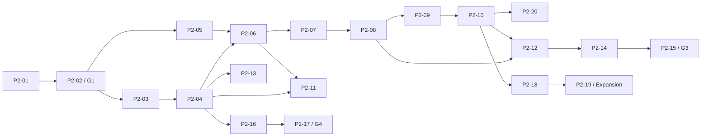

# PMFreak Sequential Build Plan (P2)

**Status:** Approved planning baseline; implementation not started.
**Repository planning point:** branch `work`, HEAD `a256a8323465bfc79a010857510805bcdd6b03b2`, clean before P2 files.
**Normative precedence:** P0 target → P1 observed state → this delivery bridge.

## Executive Build Strategy

Build one commercial spine by preserving the governed operational-flow transaction, adapting—not deleting—historical H3–H10 and AOC components, and closing one observable transition per increment. Twenty prompts cover ten work packages. Founder Invite follows WP1→WP2→WP3→WP4→WP5→WP6→WP7; WP8/WP9 are PMO Pilot and WP10 is Expansion. Tests live in every increment, not a final phase. Track C may start from verified contracts with visibly labelled expiring fixtures, but G3 requires real contracts throughout.

The state machine is `NOT_STARTED → IN_PROGRESS → IMPLEMENTED_NOT_VERIFIED → VERIFIED`, with terminal/intervention states `BLOCKED` and `REJECTED`. Only acceptance evidence permits `VERIFIED`. Dependent work cannot start from `BLOCKED`, `IMPLEMENTED_NOT_VERIFIED`, or `REJECTED`.

## Ratified Product Decisions

- **D1:** `operational_decision_records` and governed recommendations are canonical; parallel models are classified adapters/bounded models/projections/sources/candidates, never silently fused or removed.
- **D2:** Founder intake is controlled manual `DEMO / FIXTURE`, using real Source→Raw Input→Normalized Event→Evidence contracts.
- **D3:** PMFreak internal Task is first SoR; external providers follow through adapters.
- **D4:** AOC-E in-process is initial governed mode; remote `allowDecisionWriteback: false` is invariant.
- **D5:** external writes, grant/delegation/authority mutation, material agent actions, knowledge elevation and policy-classified actions require AOC. Ordinary authorized PM business writes remain PMFreak decisions.
- **D6:** Command Center is a persona/entity experience; persisted records are configuration/activation/read models pending consumer proof.
- **D7:** frontend fixtures are labelled, contract-conformant, impossible to confuse with live data, and carry a replacement prompt/gate.

## Current-to-Target Bridge

| P1 rupture | Existing asset to preserve | Bridge prompts | Target proof |
|---|---|---|---|
| Parallel domain models | operational-flow RPC, H3–H6, decision audit | P2-01/02 | G1 canonical IDs, adapters, consumer safety |
| Direct Evidence insertion/zero hash | manual capture, evidence tables | P2-03/04 | content-addressed Raw→Event→Evidence and UI |
| Decision stops before Action | AOC runtime/grants, business Decision | P2-05/06 | separate Action with allow/deny/revoke/unavailable |
| Legacy Recommendation→Task | task drafts/execution tasks | P2-07/08 | allowed Action creates exactly one internal Task |
| Outcome subsystem disconnected | outcome/reconciliation engines | P2-09/10/20 | observed Outcome and complete audit lineage |
| Fragmented PM frontend | inbox, shell, critical-path/task panels | P2-11/12 | one accessible project journey |
| No reproducible runtime proof | seed, DB checker, auth/invite tests | P2-13/14/15 | G3 17-step, two-tenant acceptance |
| Schedule/portfolio adjacent | H7–H10 engines/pages | P2-16/17 | G4 qualified exposure/portfolio attention |
| Learning disconnected | learning/ratification foundations | P2-18/19 | independent Expansion elevation gate |

No P2 Planning Exception was found. The current repository supports the planned paths; actual migration necessity remains a prompt-time evidence decision, always additive.

## Work Package Dependency Graph

## Prompt Inventory and Sequence

| ID | WP | Title | Track | Depends on | Phase |
|---|---|---|---|---|---|
| P2-01 | WP1 | Canonical Domain Contract and Consumer Map | A | none | Founder |
| P2-02 | WP1 | Compatibility Adapters, Correlation Spine and Legacy Safety Gate | A | P2-01 | Founder |
| P2-03 | WP2 | Raw Input and Normalized Event Foundation | A | G1 | Founder |
| P2-04 | WP2 | Evidence Derivation and Manual Provenance Experience | A/C | P2-03 | Founder |
| P2-05 | WP3 | Material Action and Governance Contract | B | G1 | Founder |
| P2-06 | WP3 | In-Process AOC Decision-to-Action Vertical Slice | B/A/C | P2-04/05 | Founder |
| P2-07 | WP4 | Canonical Action-to-Task Adapter | A | P2-06 | Founder |
| P2-08 | WP4 | Idempotent Internal Dispatch and Execution Experience | A/C | P2-07 | Founder |
| P2-09 | WP5 | Outcome and Observation Contract | A | P2-08 | Founder |
| P2-10 | WP5 | Outcome Review and Complete Lineage Experience | A/C | P2-09 | Founder |
| P2-20 | WP5 | Closed-Loop Audit Export Compatibility Gate | D/A | P2-10 | Founder |
| P2-11 | WP6 | PM Execution Center Attention-to-Decision Experience | C | P2-04 + verified action contract | Founder |
| P2-12 | WP6 | PM Execution Center Action-to-Outcome and Accessibility Gate | C | P2-08/10/11 | Founder |
| P2-13 | WP7 | Founder Invite Seed and Isolated Environment Harness | D | P2-04/G1 | Founder |
| P2-14 | WP7 | Authenticated Two-Tenant Founder Browser Story | D | P2-12/13 | Founder |
| P2-15 | WP7 | Governance, Audit and Release Readiness Gate | D | P2-14 | Founder |
| P2-16 | WP8 | Schedule Exposure Adapter and Experience | A/C | P2-04/G1 | Pilot |
| P2-17 | WP9 | Qualified Portfolio Projection and PMO Attention Experience | A/C | P2-16 | Pilot |
| P2-18 | WP10 | Learning Candidate Eligibility and Lineage | A | P2-10 | Expansion |
| P2-19 | WP10 | Governed Ratification, Revocation and Learning Review | B/C | P2-18 | Expansion |

## Founder Invite Critical Path

Strict chain: `P2-01 → P2-02/G1 → P2-03 → P2-04 → P2-06 → P2-07 → P2-08 → P2-09 → P2-10 + P2-20 → P2-12 → P2-14 → P2-15/G3`. P2-05 starts after G1 and must join before P2-06. P2-11 starts after P2-04 and consumes only verified P2-06 contracts or a labelled fixture expiring at P2-06. P2-13 starts after P2-04 and joins at P2-14. Founder Invite does not await P2-16–19.

## PMO Pilot and Expansion Path

P2-16 may start after G1 and P2-04, in parallel with Founder execution work; it adapts H7–H9 without rewriting engines. P2-17 starts only after P2-16 and should preferably integrate after G3 to avoid PMO scope distracting from Founder Invite. P2-18 starts after P2-10 outcome evidence; P2-19 follows and has an independent Expansion gate. WP10 does not block G4.

## Parallel Track Plan

| Prompt(s) | Primary track | Parallel condition | Cross-track join |
|---|---|---|---|
| P2-03 and P2-05 | A / B | G1 VERIFIED, isolated worktrees | P2-04/05 both VERIFIED before P2-06 |
| P2-11 | C | P2-04 VERIFIED; action uses labelled contract fixture only | fixture removed/replaced by P2-06; joins P2-12 |
| P2-13 | D | P2-04 VERIFIED | joins real UI at P2-14 |
| P2-16 | A/C | G1 + P2-04 VERIFIED; does not modify Founder spine ownership | feeds P2-17, not G3 |
| P2-18 | A | P2-10 VERIFIED; isolated from Founder branch | joins P2-19 only |

Use separate branches/worktrees; never combine parallel prompts in one dirty tree. Contract owner merges first, consumers rebase only by authorized non-destructive workflow. Track C hardcoded success is prohibited.

## Acceptance Ladder

- **G1 — Canonical Spine Ready:** P2-01/02 `VERIFIED`; exported contracts, legacy consumer/classification map, compatibility/event tests, no silently broken consumer.
- **G2 — Governed Execution Loop Ready:** P2-03–10 and P2-20 `VERIFIED`; provenance, Recommendation/Decision separation, AOC allow/deny/degraded, one Task under retry, distinct Observation, complete/redacted lineage.
- **G3 — Founder Invite Ready:** G2 plus P2-11–15 `VERIFIED`; authenticated browser story, session refresh, two-tenant/RLS, 17 steps, honest fixture, reproducible reset, audit, build/release gates.
- **G4 — PMO Pilot Ready:** G3 recommended plus P2-16/17 `VERIFIED`; qualified schedule/portfolio projections, coverage/confidence and safe drill-down.
- **Expansion gate:** P2-18/19 `VERIFIED`; candidate eligibility, governed ratify/reject/revoke and retrieval. Independent of G4.

## Contract and Migration Strategy

| Prompts | Migration | Compatibility / backfill | RLS/audit/recovery |
|---|---|---|---|
| 01–02 | no/possible additive refs | no destructive merge; adapter reads; dual-write only if explicitly bounded through P2-15 | contract tests; revert adapter, retain history |
| 03–04 | yes, additive likely | optional backfill marks legacy evidence provenance incomplete; never synthesize provenance | immutable raw/event, workspace/project RLS; `check:operational-flow-db` |
| 05–06 | additive Action/request likely | legacy decisions remain; no remote writeback | AOC refs/obligations, fail closed, DB verifier |
| 07–08 | possible additive idempotency/ref | adapt H5/H6; dual-write discouraged, if unavoidable expires P2-15 | unique idempotency, task RLS, reconcile safely |
| 09–10/20 | additive Outcome/links likely | retain agent outcomes via adapter; no achievement backfill from Task | append-only observations/audit; dispute/retract rather than overwrite |
| 11–15 | normally no product schema | fixture replacement at P2-06/08/10; deterministic seed reset only isolated data | two-tenant and cleanup proof |
| 16–19 | possible additive projections/learning | retain H7–H10/memory consumers | quality/elevation RLS and retention/revocation |

Physical deletion is outside initial P2 and requires later consumer proof, migration plan, runtime replacement, tests and human approval. Migrations are forward-only. Recovery disables new adapter/feature and preserves audit; rollback never deletes recorded decisions/evidence.

## Frontend Integration Strategy

| UI increment | Contract | Fixture policy / replacement | Required UX proof |
|---|---|---|---|
| P2-04 provenance | P2-03 real | manual input itself labelled `DEMO / FIXTURE`; data contract is real | empty/loading/error/stale/duplicate; accessible component/browser |
| P2-11 recommendation/decision | P2-01/04 real | action placeholder allowed only labelled; replaced P2-06 | no global context leakage; denied and confidence states |
| P2-06 Action | P2-05/AOC real | none for acceptance | allow/deny/revoke/unavailable |
| P2-08 Task | P2-07 real | none | retry/failure/lifecycle; no outcome success |
| P2-10/12 Outcome/lineage | P2-09 real | none at final gate | incomplete/disputed and accessible timeline |
| P2-14 Founder | all real except labelled manual demo input | no backend mock | browser refresh/two tenant/screenshots/no layout regression |
| P2-16/17 Pilot | verified project/schedule projections | fixtures only contract-labelled before respective acceptance, then removed | responsive, coverage/confidence, safe drill-down |

## AOC Consumption Strategy

P2-05 freezes the PMFreak adapter to AOC-P/AOC-E; P2-06 consumes AOC-E in-process. Canonical owner remains AOC for policy, grant, obligation, delegation, revocation, identity/integrity primitives; PMFreak stores references and business state. Remote mode remains advisory/unavailable and `allowDecisionWriteback=false`. Material actions fail closed on unavailable/stale verification. Ordinary PM business decisions stay PMFreak-authorized and audited. Contract doubles may unlock parallel UI only if AOC interface is verified and the double is labelled/replaced before G2. Run package/boundary/no-bypass tests in every Track B prompt. P2-19 reuses the same boundary for knowledge elevation.

## Test and Runtime Verification Strategy

Every prompt runs targeted behavioral tests, typecheck, lint and `git diff --check`; high-risk/UI prompts run build. Migration prompts run `npm run check:operational-flow-db` on isolated Supabase and negative RLS. Track B runs `npm run check:aoc-boundaries && npm run check:no-local-auth-bypass`. P2-14 adds authenticated browser/session/two-tenant runtime proof; P2-15 runs beta/release readiness. Source scans never suffice alone. Evidence records exact command, exit, environment, observable state and cleanup. A skipped applicable check yields `IMPLEMENTED_NOT_VERIFIED`, never `VERIFIED`.

## Branch, Commit and Review Strategy

Convention: branch `build/<prompt-id>-<slug>` (for example `build/p2-01-canonical-spine`); commit `feat(<wp>): <prompt-id> <outcome>` or `test/docs/fix` as appropriate. One principal commit per prompt; a separate forward migration/contract commit is allowed when review safety requires it. Start with branch/HEAD/status and instructions; stop on overlapping user changes. End with diff summary and `git diff --check`. Use isolated worktrees for parallel work. No destructive reset/rebase, push or PR without separate authorization. Flags require owner, removal condition and expiry gate. Adapters require deprecation plan; migrations are forward-only.

## Risk Register

| Risk | Trigger | Prevention | Detection | Response | Blocks |
|---|---|---|---|---|---|
| Parallel decisions | new flow bypasses D1 | canonical refs/adapters | consumer/lineage tests | stop, reconcile adapter | G1 |
| Schema drift | types/migration diverge | additive contract first | DB/type contract | corrective forward migration | G1/G2 |
| Hidden consumers | removal/change surprises route | inventory/no deletion | build/runtime grep telemetry | preserve compatibility | G1 |
| Direct Evidence | API inserts evidence | Event-only derivation | integration/DB guard | reject/quarantine | G2 |
| Provenance corruption | bad digest/link | content address/immutable link | replay/hash test | mark disputed, never rewrite | G2 |
| Authority duplication | PM role mimics AOC allow | adapter boundary | no-bypass tests | fail closed | G2 |
| Remote writeback | flag enabled | hard invariant | config test | reject change | G2 |
| AOC unavailable | timeout/stale | explicit state | failure injection | deny/queue safe, inform user | G2 |
| Idempotency failure | retry duplicates Task | unique key/transaction | retry/concurrency test | reconcile and block | G2 |
| Task=Outcome | done auto-achieves | separate contracts | lifecycle regression | reopen outcome/correct audit | G2 |
| Mock leakage | fixture looks live | label/type/expiry | browser assertion | hide/reject release | G3 |
| Context loss | wrong workspace/project | server scope | IDOR/two-tenant test | deny and log | G3 |
| Session regression | refresh rotates/loses cookie | one continuity path | browser refresh | block Founder | G3 |
| RLS mismatch | route works only service role | least privilege | isolated DB negative | fix forward policy | G3 |
| Audit fragmentation | missing correlations | canonical IDs/events | export completeness | mark gap/block | G2/G3 |
| CI zero jobs | conditions skip gate | explicit workflow assertions | remote run inspection | block release | G3 |
| PMO scope creep | WP8/9 delays WP1–7 | separate phase/branches | dashboard dependency | defer Pilot | G3 |

## Stop/Resume Rules

Stop on unverified dependency, overlapping dirty tree, missing isolated infrastructure/credential, migration collision, unclear AOC canonical contract, needed authorization weakening, non-ratified product decision, contradictory tests without authority, or scope expansion. Record `BLOCKED` with exact evidence and decision owner. `IMPLEMENTED_NOT_VERIFIED` means implementation exists but an applicable gate is missing. Resume only after blocker resolution is documented and preconditions rechecked. `REJECTED` requires a new approved approach; dependent prompts cannot bypass it. Parallel work proceeds only from a `VERIFIED` contract explicitly listed in this plan.

## Definition of Done by Work Package

| WP | Cumulative DoD |
|---|---|
| WP1 | User/auditor sees one vocabulary; contracts, consumers, IDs/events and adapters verified; build/compatibility pass; no destructive migration or unresolved spine blocker |
| WP2 | PM sees labelled intake provenance; authorized immutable Raw/Event/Evidence persist with digest/RLS, duplicate/degraded tests, UI and DB proof |
| WP3 | PM sees separate Action allow/deny/revoke/unavailable; business/AOC authority distinct; persisted audit/refs; remote false; tenant/AOC tests |
| WP4 | Allowed Action creates exactly one internal Task; lifecycle UI, retry/reconcile/error, RLS/audit/build; no Outcome closure; H5/H6 compatible |
| WP5 | Expected/observed Outcome and full redacted lineage persist; authorized review, disputed/incomplete states, targeted/runtime tests; legacy outcomes adapted |
| WP6 | Authenticated PM completes coherent accessible project journey on real contracts; all honest states/browser/build; Command Center remains experience |
| WP7 | Deterministic resettable 17-step two-tenant demo proves session/RLS/AOC/audit/observability/release; limitations documented; all P1 Founder blockers closed |
| WP8 | Typed schedule change deterministically yields evidence-linked Finding/Recommendation; context/confidence/missing/invalid topology and UI tests; engines preserved |
| WP9 | PMO gets qualified portfolio attention with coverage/confidence/restricted drill-down and tenant/runtime proof; unsupported conflicts absent |
| WP10 | Complete lineage yields Candidate; authorized AOC ratify/reject/revoke controls scoped retrieval/retention; no causality/auto-elevation; audit/UI/tests |

## Prompt File Manifest

The authoritative linked manifest is in [`prompts/README.md`](prompts/README.md). It contains 20 self-contained files, P2-01 through P2-20. P2-20 belongs to WP5 and is placed after P2-10 in execution order despite its numeric suffix; IDs are stable identifiers, not permission to ignore dependency metadata.

## Execution Dashboard Template

Update only after real verification; generated code is not progress.

**Gate status — exact-head reconciliation 2026-09-19, authorized repairs 2026-09-20.** The exact-main pass at `95c928b2` found two product defects and recorded G2 `BLOCKED` (`P2-10-LINEAGE-FINDING-UNRESOLVED`, which also blocked P2-20) and G3 `BLOCKED` (that, plus `D1-INVITE-ACCEPT-LAYOUT-RACE` and the P2-12 → P2-14 → P2-15 dependency chain). Both were repaired under explicit authorization. Exact-head validation of that candidate then surfaced a THIRD, pre-existing defect that `95c928b2` shares: governance precedence was decided by `evaluated_at`, a descriptive timestamp supplied by the writer, so a committed and visible revocation could be masked by an authorization that merely sorted newer — a revoked Material Action could still be dispatched into a canonical Task and a revoked queued execution could still start. That is repaired too, by making revocation terminal at both execution boundaries.

**G2 `VERIFIED`** and **G3 `VERIFIED`** on committed SHA `75816028089a0296b1216372c3d9c45f90cb83bf` (C7), verified from a clean checkout carrying the full stack and none of this reconciliation's documentation edits.

C4 (`0fd86b561326c7895980fffb5c47c8aa6b8585c5`) certified the candidate as it stood; PR review of that candidate then found that the restored Finding projection rendered a Signal's persisted 0-100 confidence on the 0-1 lineage scale (92 → `9200.0%`), a defect this branch made reachable. C7 repairs it and is the final exact executable verification SHA. The per-prompt sections below record C4 because that is the SHA they were run on, and are left as they were.

**Pre-rebase → `main` SHA map.** PR #614 was merged with a rebase, so every SHA quoted in these records was replayed onto `main` under a new id. The originals remain resolvable through the PR ref (`refs/pull/614/head`) but are NOT in `main`'s history, so `git show` against `main` alone will not find them. Each pair below was confirmed to have an identical tree, so the evidence is unaffected — only the name changed.

| Commit | Pre-rebase SHA (as recorded in these documents) | On `main` after rebase |
|---|---|---|
| C1 canonical Finding lineage | `d0e26fefa9b502a227d54ca13243bdc6f066decb` | `0536317dd03a28a89cce32fe9050ef9f875da462` |
| C2 workspace invite acceptance | `e9c3addfd7060139525cfc9e54d95cf6699533d2` | `4e2f5f48ff37d5ed91fb602f3bee5d02c9e839db` |
| C3 Founder story reconciliation | `da7c5fbbfc426165e8ef237e1cfd2c1b1a693a14` | `534c02f74582c8498bfacffa90ef41cef8d4a61c` |
| **C4 terminal revocation** | `0fd86b561326c7895980fffb5c47c8aa6b8585c5` | `97d7d59873fde2a67f215b4f49b0d1622831b91a` |
| C5 exact-head G2/G3 record | `8c8142d221a7ffdf54d609c31e3eadcf4703df0e` | `1f879543768578ccaa4430d2608440cc72262489` |
| C6 migration-count correction | `3245e0bccb692734c97d958c365e94807b1213b0` | `dd1188b3bb901408fef1578cb0276084b3986056` |
| **C7 final exact executable verification SHA** | `75816028089a0296b1216372c3d9c45f90cb83bf` | `7cd64e9cded628b7cc3d70efd2d09941729e4ea6` |
| C8 final-SHA reconciliation | `c9d5dcd801064e8689d229a8eefecd9baceac8e4` | `311a52de89c6bcee14a508718ad4fcb6b46e9c12` |

The per-prompt evidence sections keep quoting the pre-rebase SHAs, because those are the ids the runs were actually performed against. This table is the one place that reconciles them with `main`.

**P2-16 PR #616 pre-rebase → `main` SHA map.** PR #616 was also merged with a rebase on 2026-09-21. The verification records intentionally keep the PR SHAs because those are the exact ids used for the recorded runs. Each pair below was proven to have an identical tree before this map was recorded, and the final `main` tree at `cc16d1f785cac7e573f0975e5fccdbe502180a0b` was proven identical to the verified PR head `553ab12dd3ed4d6a01eae815a6d56637283feefa`. This is identifier reconciliation only; P2-16 remains VERIFIED and P2-17 remains unlocked but NOT_STARTED.

| Commit | PR #616 SHA (as recorded in verification) | On `main` after rebase |
|---|---|---|
| Initial P2-16 schedule exposure implementation | `b602363ec5f3536a16fdfc1a6368ffd004b8f027` | `fcc219689fd0a06b55c128ee676bb5740d9ec0c1` |
| Initial P2-16 verification documentation | `1e4c510e8fff6d8c5ca39154bf255aad62cbd53b` | `86d082b7403aa6087ed35557cdb3920fe0191369` |
| CodeQL entity-decoding test fix | `ba2ef081d17a773b038510629fd0c7cac02b7d00` | `17353ff72502f01d114d6c598ee569797b625896` |
| **Final P2-16 executable verification SHA — trust/recovery hardening** | `d001345dbf6a70e362e9d0abbc4c8d2625ef5246` | `131f46b5dde2bbe9bc88a131bfe1796e598bdcc4` |
| Final P2-16 review verification documentation / PR head | `553ab12dd3ed4d6a01eae815a6d56637283feefa` | `cc16d1f785cac7e573f0975e5fccdbe502180a0b` |

As with PR #614, the historical verification sections are not rewritten to use rebased ids. The table above is the reconciliation point between the exact PR verification SHAs and their equivalent commits in `main`.

`95c928b2` is the blocker-discovery baseline and never carried the repairs. The decisive evidence on C4: the canonical chain Source → … → Observation exports complete with the Finding resolved and no false gap; invite acceptance lands on `/team` with the membership already committed and no stray workspace; a revocation recorded with a timestamp deliberately OLDER than the authorization it revokes still refuses both dispatch and start (10/10 each, alongside 10/10 ordinary flows); the P2-14 browser journey passes 38/38; and `check:beta-release` returns CONDITIONAL GO with Dependency Security the only (advisory) warning. Each prompt's "Verification Evidence — 2026-09-19" and "Exact-head post-repair verification — 2026-09-20" sections carry the chronology. P2-03 to P2-08 were re-verified on the same SHA.

**Gate status — G4 exact-main certification 2026-09-21.** The first exact-main G4 pass found a P1 defect: P2-16 schedule-derived Findings/Recommendations re-entered PMO attention as generic Current reasons, duplicating the current exposure after a schedule change and remaining Current after the schedule was fixed and re-evaluated to `no_exposure`, while the superseded exposure still set level and rank. It was repaired in PR #620 (`8f5405bc` → `2b31eee9`, merged with a merge commit, so the SHAs are unchanged on `main`), including two review findings: >500-id provenance lookups are no longer silently truncated, and superseded fixture provenance stays labelled.

**G4 `VERIFIED`** on `main` at `3b26a90377bf5d61a2488d9b7f9211e49016bbc1` (PR #620 merge), certified 2026-09-21 from the canonical checkout with HEAD = `origin/main`, against the local disposable stack only (schema 167/167 migrations, matching `main`). Evidence: live G4 scenarios through the real APIs and PMO Command Center — current exposure, changed exposure, fix re-evaluated to `no_exposure`, text-detected `schedule_risk` — 3/3 on three consecutive runs (and failing on the pre-repair `0bc079af`); Chromium P2-16 11/11 and P2-17 9/9 (STEP 04 superseded semantics via UI and API); P2-16 46/46; critical-path 159/159; P2-17 portfolio 26/26 and UI 9/9 (>500 Signal/Evidence ids, unresolved schedule provenance, full Signal-read failure, fixture provenance); P2-17 prompt gate 180/180; `check:p2-16-db` PASS (12 concurrent calls → created 1); `check:operational-flow-db` 22/22; typecheck; lint 0 errors; governance/AOC, `check:no-local-auth-bypass` and `check:security-definer-hardening` PASS; build 416/416 pages. The full suite could not run 100% clean on one local OS because the checkout's `node_modules` is Windows-installed (WSL 14,517 pass / 13 fail, all `better_sqlite3` `invalid ELF header`; native Windows exposes POSIX assumptions in the test harness). These are environment issues, not G4 failures; a Linux-installed checkout of the identical tree and CI on `3b26a903` passed. One non-blocking limitation is recorded as a follow-up: P2-16 does not persist `no_exposure`, so a changed-but-not-re-evaluated schedule and one re-evaluated to `no_exposure` are both shown as superseded provenance with `schedule_reevaluation_needed`. Full record: P2-17 prompt, "G4 exact-main certification — 2026-09-21".

| Prompt ID | WP | Track | Status | Branch/Commit | Dependencies | Tests | Gate | Blocker | Next |
|---|---|---|---|---|---|---|---|---|---|
| P2-01 | WP1 | A | VERIFIED | `work` / P2-01 commit | none | 242 focused + 6 spine; typecheck/lint/AOC | contributes to G1 | — | P2-02 |
| P2-02 | WP1 | A | VERIFIED | `feat/p2-02-compatibility-spine` / P2-02 commit | P2-01 VERIFIED | 7 compatibility + 6 spine + 19 flow/evidence + 508 bounded regressions; typecheck/lint/AOC/build | G1 VERIFIED | — | review; do not auto-start dependents |
| P2-03 | WP2 | A | VERIFIED | `build/p2-03-raw-input-normalized-event` / P2-03 + recovery commits | G1 VERIFIED | 15 contract; fresh + existing-history migration; isolated DB/RLS/runtime; typecheck; lint 0 errors/614 warnings; build; AOC/auth-bypass | passed | — | P2-04 unlocked; do not auto-start |
| P2-04 | WP2 | A/C | VERIFIED | `build/p2-04-evidence-provenance` / P2-04 commit | P2-03 VERIFIED | 27 focused/operational-flow; isolated fresh DB + 22 DB/RLS; browser; typecheck; lint 0 errors/614 warnings; build 411 pages; AOC/auth-bypass | passed; contributes to G2, which remains not eligible | — | P2-06 after P2-05; P2-11 after verified action contract; P2-13 and P2-16 unlocked; do not auto-start |
| P2-05 | WP3 | B | VERIFIED | `build/p2-05-material-action-governance-contract` / P2-05 commit | G1 VERIFIED | 26 focused/AOC/no-bypass; typecheck; lint 0 errors/614 warnings; build 411 pages; targeted ESLint | passed; contract-only, no migration/UI/runtime mutation | — | P2-06 unlocked after review; do not auto-start |
| P2-06 | WP3 | B/A/C | VERIFIED | `build/p2-06-in-process-aoc-decision-to-action` / P2-06 commit | P2-04 and P2-05 VERIFIED | 30 focused; isolated fresh DB + 46 P2-06 RPC/RLS/concurrency assertions; authenticated browser; Linux Governance Gate 12,907/12,907 passed with 17 skips; typecheck; lint 0 errors/614 warnings; build; AOC/auth-bypass | passed; contributes to G2, which remains NOT VERIFIED | — | P2-07 and P2-11 unlocked; do not auto-start |
| P2-07 | WP4 | A | VERIFIED | `build/p2-07-canonical-action-to-task-adapter` / P2-07 commit | P2-06 VERIFIED | 10 focused; 108 execution-task regressions; isolated fresh DB; 115 P2-07 RPC/RLS/idempotency/concurrency assertions; concurrency 2/5/10 each produced exactly one Task; P2-06 DB 46 assertions; typecheck; targeted ESLint exit 0; build; AOC/auth-bypass | passed; contributes to G2, which remains NOT VERIFIED | repo-wide lint baseline remains nonzero; P2-07 changed lintable files have zero errors | P2-08 unlocked; do not auto-start |
| P2-08 | WP4 | A/C | VERIFIED | `0fd86b56` (C4) | P2-07 VERIFIED | P2-08 DB 176 assertions (155 + terminal-revocation regression); 130 focused; 13 contract; browser via P2-14 STEP_13 | contributes to G2 | — | — |
| P2-09 | WP5 | A | VERIFIED | `95c928b2` (2026-09-19); re-verified `0fd86b56` (C4) | P2-08 VERIFIED | P2-09 DB 74 assertions; 180 focused + 7 contract; browser via P2-14 STEP_14–16b | contributes to G2 | — | — |
| P2-10 | WP5 | A/C | VERIFIED | `0fd86b56` (C4) | P2-09 VERIFIED | 48 P2-10 (4 new finding-resolution) + 79 focused; live lineage/export complete on 2 browser-created chains | contributes to G2 | — (was `P2-10-LINEAGE-FINDING-UNRESOLVED`; repaired) | — |
| P2-11 | WP6 | C | VERIFIED | `95c928b2` (2026-09-19); re-verified `0fd86b56` (C4) | P2-04, G1, P2-06 VERIFIED | 205 focused + 40 P2-11; browser via P2-14 STEP_07–10 | contributes to G3 | — | — |
| P2-12 | WP6 | C | VERIFIED | `0fd86b56` (C4) | P2-10 VERIFIED | 205 focused + 95 P2-12; browser STEP_11–16c, a11y, responsive | contributes to G3 | — (was dependency P2-10) | — |
| P2-13 | WP7 | D | VERIFIED | `95c928b2` (2026-09-19); re-verified `0fd86b56` (C4) | P2-04, G1 VERIFIED | preflight/reseed/verify COMPLETE; check:p2-13-db PASS; 15 + 37 tests; minimum Frontera provisioning audited | contributes to G3 | — | — |
| P2-14 | WP7 | D | VERIFIED | `0fd86b56` (C4) + spec reconciliation | P2-12, P2-13 VERIFIED | Chromium 38/38; check:p2-14-db 38; invite acceptance 12/12 with 0 stray workspaces; 7 new isolation tests | contributes to G3 | — (was dependency P2-12 + `D1-INVITE-ACCEPT-LAYOUT-RACE`; both repaired) | — |
| P2-15 | WP7 | D | VERIFIED | `0fd86b56` (C4) | P2-14 VERIFIED | governance/AOC/no-bypass/Frontera/security-definer/release/compliance/fresh-DB PASS; beta-release CONDITIONAL GO with rehearsal 28/28 | G3 VERIFIED | — (was dependency P2-14) | — |
| P2-16 | WP8 | A/C | VERIFIED | `d001345d` (final, exact-head re-verified; `b602363e` superseded after review reopened it); re-verified `3b26a903` (G4 exact-main) | G1, P2-04 VERIFIED | 159 critical-path + 46 P2-16; check:p2-16-db 200; operational-flow-db ok; fresh-DB 167/167; SD 33 (authenticated 23); npm test 14,492/0 fail; Chromium P2-16 11/11 + P2-14 38/38; typecheck; lint 0 errors/643 (= baseline); build | contributes to G4 | — (Codex review findings #1–#5 repaired) | P2-17 unlocked; do not auto-start |
| P2-17 | WP9 | A/C | VERIFIED | `9b9f689e`; G4 repair PR #620 (`2b31eee9`); re-verified `3b26a903` (G4 exact-main) | P2-16 VERIFIED | 207 focused + 1 module-mock; operational-flow-db ok; npm test 14,522/0 fail; Chromium P2-17 9/9 ×3; typecheck; lint 0 errors/642; build; AOC/auth-bypass. G4 on `3b26a903`: see gate status above | G4 VERIFIED (`3b26a903`, 2026-09-21) | — (was G4 P1 stale schedule-risk attention; repaired in PR #620) | P2-18 next (P2-10 VERIFIED; WP10 does not depend on G4); do not auto-start |
| P2-18 | WP10 | A | VERIFIED | `b93dd9fb` (final; `a32335ff` superseded after review found the service-role direct-write gap) | P2-10 VERIFIED | 23 P2-18 + 77 minimum acceptance + 122 canonical contracts + 81 P2-16/17; check:p2-18-db 155 (LIVE lineages; idempotency, concurrency, supersession, RLS/IDOR, no direct DML for any role incl. service_role, provenance guard); fresh-DB 168/168; operational-flow-db 22/22; p2-09-db 74; p2-16-db 200; SD 34 (authenticated 24); npm test 14,549 (2 WSL line-ending, 7/7 native); typecheck; lint 0 errors/642; build 417 | contributes to Expansion gate | — | P2-19 unlocked; do not auto-start |
| P2-19 | WP10 | — | NOT_STARTED | — | see prompt | — | — | — | — |
| P2-20 | WP5 | D/A | VERIFIED | `0fd86b56` (C4) | P2-10 VERIFIED | 23 focused + 50 P2-20; live export: Finding included, no false gap, redaction and tenancy PASS | G2 VERIFIED | — (was dependency P2-10) | — |

## P2 Approval Checklist

- [x] P0/P1 precedence and D1–D7 incorporated without re-audit.
- [x] WP1–WP10 covered by 20 complete prompts; WP1–WP7 Founder critical path explicit.
- [x] WP8–WP10 separated from Founder Invite; parallel joins are contract-gated.
- [x] Every prompt contains exactly 20 required sections, status machine, exact dependencies, tests, acceptance commands and stop conditions.
- [x] G1–G4 plus Expansion gate, migration/compatibility, frontend fixture replacement, AOC in-process boundary and remote-writeback invariant defined.
- [x] Branch/commit/review strategy, risk register, cumulative DoD, linked manifest and `NOT_STARTED` dashboard present.
- [x] First implementation prompt P2-01 is self-contained and executable without further planning.
- [x] P2 modifies documentation only; implementation remains unstarted.
